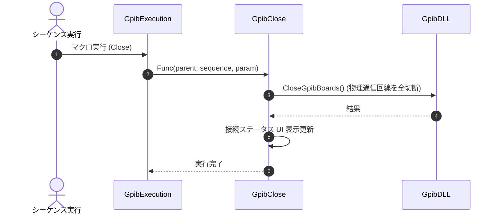

# コマンドリファレンス：Close

## 概要
`Close` は、現在アクティブになっているすべてのGPIBボード・機器との物理通信回線を安全に切断（クローズ）し、ハードウェアおよびUIのステータスを初期状態へとクリーンアップする物理通信・ライン制御系コマンドです。
自動測定シーケンス of 正常終了時だけでなく、エラー発生時の緊急シャットダウン処理において、リソースの開放漏れ（ハンドルリーク）を防ぐために使用します。

> 💡 **補足 / ⚠️ 注意**
> 内部の切断処理は `finally` ガードにより保護されています。切断中に万が一ハードウェアエラー等の例外が発生した場合でも、UIやタイマーの停止状態が確実に保証されます。

## 🔄 動作フロー（シーケンス図）
本コマンド実行時における、シーケンス実行エンジン（GpibExecution）、コマンドクラス（GpibClose）、および物理通信層（GpibDLL）間のインタラクションを示すシーケンス図です。



---

## 💡 書式・パラメータ仕様

```csv
,SEQUENCE, [ステップキー], Close
```

### パラメータ（引数）一覧

本コマンドは実行にあたり引数を必要としません。コマンド名（`Close`）を指定するだけで、システムが管理するすべてのGPIB接続を一括切断します。

| 引数位置 | 引数名 | 説明 | 指定方法 / 有効な入力値 |
| :--- | :--- | :--- | :--- |
| — | — | なし（パラメータの指定は不要です）。 | — |

---

## 🔄 特殊置換規約・分岐規約の適用

本コマンドは引数を必要としないため、独自スクリプトの特殊記法の適用対象外です。

*   **動的置換（`$`）**: 引数を使用しないため、変数置換は使用しません。
*   **条件ジャンプ（`#`）**: 本コマンドはジャンプ処理を行わないため、引数内での `#` によるステップキー指定は使用しません。
*   **カンマのエスケープ**: 引数を持たないため、カンマのエスケープ規約は適用されません。

---

## 💡 動作例（正しい構文での記述例）

### スクリプト記述例
> ⚠️ **記述ルール注意**
> COMMANDブロック配下のため、子要素行（`PARAM`, `SEQUENCE`）は必ず行頭カンマから開始し、スペースインデントや行末コメント（`;`）は記述しないでください。コメントを入れる場合は、必ず独立したコメント行（行頭 `;`）を前に挟んでください。

```csv
COMMAND, "Standard_Measure"
; データ格納用のワークエリアを定義
,PARAM, CH1_RAW, Work, "データ格納用"
; 1. GPIB物理層の回線を接続（バスをクリーン化）
,SEQUENCE, 10, Open
; 2. 構成ファイルのデリミタ設定をハードウェア層へ同期
,SEQUENCE, 20, Init
; 3. 機器へコマンドを送信し、測定データの物理受信を実行
,SEQUENCE, 30, Send, "MEAS:VOLT?"
,SEQUENCE, 40, Receive
; 4. 受信した生データを解析し変数領域へ格納
,SEQUENCE, 50, SetData, CH1_RAW, "%s"
; 5. 一連の処理が完了したため、回線を安全に切断
,SEQUENCE, 60, Close
```

### 実行時の挙動・変数変化

*   **実行前の状態**: GPIB回線が接続されており、メイン画面上の接続インジケータが点灯、定期的なステータスポーリングタイマーが動作している状態です。
*   **実行後の状態**: リモート制御線の信号が解除（REN Off）され、物理ポートが完全に開放されます。また、接続状態を示すミニLEDランプ等のUIインジケータが一括同期して「切断（赤色）」へと変化し、データ監視タイマーが完全に停止します。

---

## 🚫 エラーハンドリング・安全設計（仕様制限）

入力データの異常や記述ミスに対し、解析・実行エンジンが実行するセーフティ規約です。

*   **非同期実行時のクロススレッドアクセスが発生した場合**
    マクロの実行エンジン（バックグラウンドスレッド）から呼び出された場合でも、内部で自動的に `InvokeRequired` 判定を行います。メインのUIスレッドへ安全に同期ディスパッチ（Invoke）して切断処理およびUI更新を実行するため、画面のフリーズやクロススレッドクラッシュを完全に防止します。
*   **切断処理中にハードウェアの物理例外が発生した場合**
    実行エンジンの切断ロジックに実装されている `finally` ガードの働きにより、低レイヤ層での例外（Exception）発生有無に関わらず、接続インジケータの消灯（赤点灯）および監視タイマーの強制停止（メモリリーク防止）を確実に実行し、UIフリーズやアプリケーションの異常強制終了を自動防御します。

---

## 🧪 ユニットテスト仕様

本コマンドクラスに実装されている `RunUnitTest()` メソッドが検証するユニットテストの仕様です。

### テスト実行前提条件
* **実行トリガー**: `RunUnitTest()` メソッドの呼び出し
* **有効化条件**: システム全体の最小ログレベル（`ErrorLogger.MinimumLevel`）が `LogLevel.Test` であること（それ以外の場合は無効化ガードにより即座に早期リターン）
* **検証結果出力**: `ErrorLogger.LogTest` によるログ出力。検証失敗時は `ErrorLogger.LogError`、予期せぬ例外発生時は `ErrorLogger.LogCritical` で記録。

### テストケース一覧

| No | テストカテゴリ | テスト条件（入力値） | 期待される結果（出力値） | 検証の目的 / 観点 |
| :--- | :--- | :--- | :--- | :--- |
| **1** | 正常系 | `GetDisconnectionStates()` メソッドを実行 | 戻り値:<br>・`MenuChecked` が `false`<br>・`RenStatus` が `ButtonStatus.Off`<br>・`UseRedLed` が `true` | 回線切断完了時におけるUI制御用の戻り値（メニューチェック状態、RENボタン状態、赤色LEDランプ使用フラグ）が仕様通り正しく設定されているかを検証。 |
