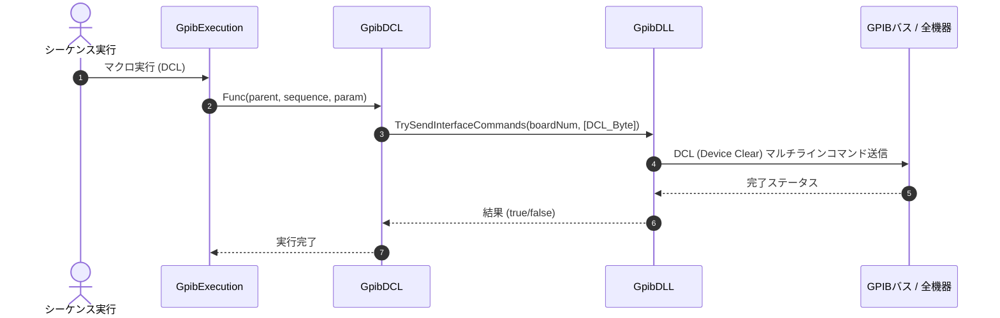

# コマンドリファレンス：DCL

## 概要
`DCL` は、現在有効になっているすべてのGPIBボードに対して DCL（Device Clear：デバイスクリア）マルチラインコマンドを一斉送出し、バス上に接続されているすべての機器を初期状態へ強制リセットする物理通信・ライン制御系コマンドです。
計測中に機器の受信バッファが溢れてフリーズした場合や、エラー状態から復帰できなくなった際の復旧、あるいは測定シーケンスを開始する直前の安全な初期化ルーチンとして使用します。

> 💡 **補足 / ⚠️ 注意**
> 画面上のDCLボタンを手動でクリックして実行した場合のみ、UI側のボタン配色が「Color.Aqua」へ一時変化し、1秒後に自動復帰（Color.Gainsboro）する視覚効果が働きます（マクロシーケンス経由での自動実行時は、ボタンの配色変化は行われません）。

## 🔄 動作フロー（シーケンス図）
本コマンド実行時における、シーケンス実行エンジン（GpibExecution）、コマンドクラス（GpibDCL）、物理通信層（GpibDLL）、および接続機器間のインタラクションを示すシーケンス図です。



---

## 💡 書式・パラメータ仕様

```csv
,SEQUENCE, [ステップキー], DCL
```

### パラメータ（引数）一覧

本コマンドは実行にあたり引数を必要としません。コマンド名（`DCL`）を指定するだけで、バス上のすべての機器に対して一括リセット信号を発信します。

| 引数位置 | 引数名 | 説明 | 指定方法 / 有効な入力値 |
| :--- | :--- | :--- | :--- |
| — | — | なし（パラメータの指定は不要です）。 | — |

---

## 🔄 特殊置換規約・分岐規約の適用

本コマンドは引数を必要としないため、独自スクリプトの特殊記法の適用対象外です。

*   **動的置換（`$`）**: 引数を使用しないため、変数置換は使用しません。
*   **条件ジャンプ（`#`）**: 本コマンドはジャンプ処理を行わないため、引数内での `#` によるステップキー指定は使用しません。
*   **カンマのエスケープ**: 引数を持たないため、カンマのエスケープ規約は適用されません。

---

## 💡 動作例（正しい構文での記述例）

### スクリプト記述例
> ⚠️ **記述ルール注意**
> COMMANDブロック配下のため、子要素行（`PARAM`, `SEQUENCE`）は必ず行頭カンマから開始し、スペースインデントや行末コメント（`;`）は記述しないでください。コメントを入れる場合は、必ず独立したコメント行（行頭 `;`）を前に挟んでください。

```csv
COMMAND, "Safe_Start_Measure"
; データ格納用のワークエリアを定義
,PARAM, CH1_RAW, Work, "データ格納用"
; 1. バス上の全機器を一括で初期状態にリセット（フリーズ対策）
,SEQUENCE, 10, DCL
; 2. 測定用配列の初期化（カンマ区切り）
,SEQUENCE, 20, Array_Init, CH1_RAW, 1, 20, ","
; 3. 計測コマンド送信とデータ回収
,SEQUENCE, 30, Send, "FETCH?"
,SEQUENCE, 40, Receive
```

### 実行時の挙動・変数変化

*   **実行前の状態**: 機器が過去のエラー状態を保持していたり、前のバッファが残って応答が不安定になっている状態です。
*   **実行後の状態**: バス上の全機器に対して物理層リセット（Device Clear）が一斉送出され、機器内の受信・送信バッファやエラーキューがクリアされクリーンな初期状態に復帰します。同時に、UI側の連動管理により専用ボタンの背景色が一時的に変化します。

---

## 🚫 エラーハンドリング・安全設計（仕様制限）

入力データの異常や記述ミスに対し、解析・実行エンジンが実行するセーフティ規約です。

*   **非同期実行時のクロススレッドアクセスが発生した場合**
    実行エンジン内部でスレッド安全なカラー制御および安全なクロススレッドアクセス（Invoke）が自動実行されます。マクロ実行用のバックグラウンドスレッドから呼び出された場合でも、UI側とシームレスに連動管理され、アプリケーションの異常強制終了（クロススレッドクラッシュ）を完全に防止します。

---

## 🧪 ユニットテスト仕様

本コマンドクラスに実装されている `RunUnitTest()` メソッドが検証するユニットテストの仕様です。

### テスト実行前提条件
* **実行トリガー**: `RunUnitTest()` メソッドの呼び出し
* **有効化条件**: システム全体の最小ログレベル（`ErrorLogger.MinimumLevel`）が `LogLevel.Test` であること（それ以外の場合は無効化ガードにより即座に早期リターン）
* **検証結果出力**: `ErrorLogger.LogTest` によるログ出力。検証失敗時は `ErrorLogger.LogError`、予期せぬ例外発生時は `ErrorLogger.LogCritical` で記録。

### テストケース一覧

| No | テストカテゴリ | テスト条件（入力値） | 期待される結果（出力値） | 検証の目的 / 観点 |
| :--- | :--- | :--- | :--- | :--- |
| **1** | 正常系 | `CanSendDcl` に対し、<br>・`true` を入力<br>・`false` を入力 | 戻り値:<br>・`true` 入力時は `true`<br>・`false` 入力時は `false` | 回線接続状態（オープン/クローズ）に基づき、DCL送信の可否が正しく判定されるかを検証。 |
| **2** | 正常系 | `GetButtonUiState` に対し、<br>・`true` （処理中）を入力<br>・`false` （非処理中）を入力 | 戻り値:<br>・`true` 入力時は `Enabled` が `false`、`BackColor` が `Color.Aqua`<br>・`false` 入力時は `Enabled` が `true`、`BackColor` が `Color.Gainsboro` | 送信処理状態に応じたDCLボタンのUI制御状態（有効化フラグ、背景色）が正しく取得できるかを検証。 |
