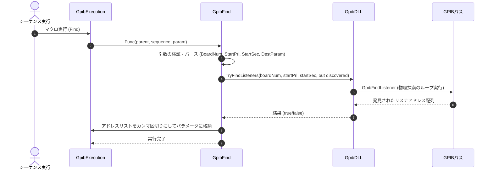

# コマンドリファレンス：Find

## 概要
`Find` は、指定されたボードにおいてアクティブな（GPIBバスに正しく接続されて電源が入っている）リスナ機器を自動探索するためのコマンドです。発見された機器のアドレスリストはカンマ区切りで指定のパラメータ変数に格納されます。

## 🔄 動作フロー（シーケンス図）
本コマンド実行時における、シーケンス実行エンジン（GpibExecution）、コマンドクラス（GpibFind）、物理通信層（GpibDLL）、および接続機器間のインタラクションを示すシーケンス図です。



---

## 💡 書式・パラメータ仕様

```csv
,SEQUENCE, [ステップキー], Find, [ボード番号], [開始プライマリアドレス], [開始セカンダリアドレス], [格納先変数]
```

### パラメータ（引数）一覧

| 引数位置 | 引数名 | 説明 | 指定方法 / 有効な入力値 |
| :--- | :--- | :--- | :--- |
| **引数1** | ボード番号 | 探索に使用するGPIBボードの番号。 | 整数（例: `"0"`）またはパラメータ動的置換 |
| **引数2** | 開始プライマリアドレス | 探索を開始するプライマリアドレス（0〜30）。 | 整数（例: `"0"`）またはパラメータ動的置換 |
| **引数3** | 開始セカンダリアドレス | SADの探索開始点。不使用時は -1。 | 整数（例: `"0"` または `"-1"`）またはパラメータ動的置換 |
| **引数4** | 格納先変数 | 発見されたアドレスのカンマ区切り文字列（例: `"2,22,23"`）を格納するパラメータキー。 | 変数プール（PARAM）に定義されているキー名（例: `FOUND_ADDRS`） |

---

## 🔄 特殊置換規約・分岐規約の適用
*   **動的置換（`$`）**: 引数において `$PARAMキー$` を用いた変数置換が可能です。

---

## 🚫 エラーハンドリング・安全設計
*   引数不足や数値のパース失敗時には、エラーログを出力して処理を安全に早期リターン（処理スキップ）します。
*   物理層エラーにより探索が失敗した場合は、エラーログを書き出し、格納先変数は更新しません。
