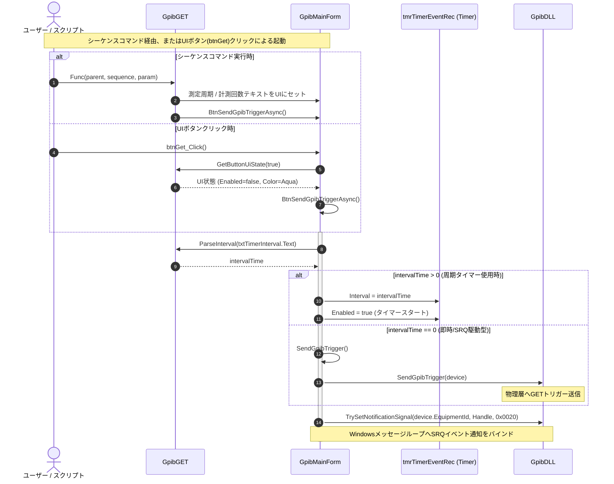
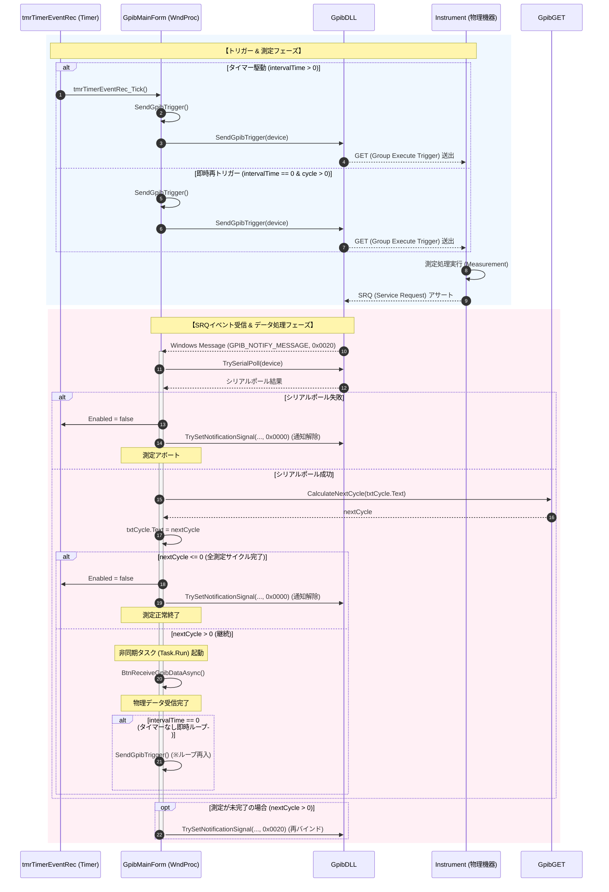

# コマンドリファレンス：GET

## 概要
`GET` は、バス上の機器に対して GET（Group Execute Trigger：グループ実行トリガー）を送出し、複数機器の同時測定（同期トリガーキック）を制御する物理通信・ライン制御系コマンドです。
単にトリガー信号を発信するだけでなく、指定された測定周期と回数を反映し、Windowsメッセージループによる自律測定サイクルを開始します。

本コマンド（`GET`）によるトリガー起動後、機器の測定完了に伴い発信されるサービス要求（SRQ）等のイベントをWindowsメッセージループ（`WndProc`）にて検知し、非同期的に自動でデータ受信（`Receive`）を実施します。

> 💡 **受信方式の選択について**
> GPIB通信におけるデータ受信方式は、用途や機器の仕様に合わせて以下のいずれかを選択可能です。
> 1. **`Receive` コマンドによるポーリング処理**:
>    `Send` で命令を送信後、同期的に `Receive` を実行してデータを読み取る一般的なポーリング方式。
> 2. **`GET` コマンドによる割り込み処理**:
>    グループ実行トリガーをトリガーし、測定完了をWindowsメッセージループで非同期に受けて自動的に `Receive`（データ受信）を実行するイベント駆動（割り込み）方式。

> 💡 **補足 / ⚠️ 注意**
> 本コマンドは、測定器側が測定完了時に発信するSRQ（サービス要求）などをWindowsメッセージループで自律的に検知する、バックグラウンド連続測定のトリガーインフラとして機能します。

---

## 🔄 動作フロー（シーケンス図）

本コマンドの実行開始から、非同期でのSRQ検出、データ受信、連続トリガーサイクルが完了するまでの全体フローです。

### 1. 測定開始シーケンス (初期化 & 初回トリガー)
マクロシーケンスからの呼び出し、またはUIのボタンクリックを契機として、測定条件のパースとタイマー初期化、SRQ検知のバインドを行います。



### 2. 非同期SRQイベント駆動型測定サイクル
タイマー発火またはデータ受信後の即時トリガーにより、機器へGETを送出します。機器での測定が完了してSRQがアサートされると、Windowsメッセージループ（WndProc）が検知し、シリアルポール、データ受信、サイクルカウントのデクリメント、再バインドを自動的に連鎖させます。



---

## 💡 書式・パラメータ仕様

```csv
,SEQUENCE, [ステップキー], GET, [測定周期(ms)], [計測回数]
```

### パラメータ（引数）一覧

| 引数位置 | 引数名 | 説明 | 指定方法 / 有効な入力値 |
| :--- | :--- | :--- | :--- |
| **引数1** | 測定周期(ms) | 連続測定を行う際のタイムインターバル（ミリ秒単位）。 | 固定値（例: `500`）またはパラメータ動的置換（例: `$P_INTERVAL$`） |
| **引数2** | 計測回数 | 連続でトリガーを発行する総測定回数。 | 固定値（例: `1000`）またはパラメータ動的置換（例: `$P_COUNT$`） |

---

## 🔄 特殊置換規約・分岐規約の適用

本コマンドの引数における、独自スクリプトの特殊記法の適用ルールです。

*   **動的置換（`$`）**: 引数内で `$PARAMキー$` のようにパラメータキーの両端を `$` で囲むと、実行時に `PARAM` の値へと動的置換されます。（適用可能な引数：引数1、引数2）これにより、品種や測定条件に応じて試験周期やサンプリング数を動的に切り替えることが可能です。
*   **条件ジャンプ（`#`）**: 本コマンドはジャンプ処理を行わないため、引数内での `#` によるステップキー指定は使用しません。
*   **カンマのエスケープ**: 本コマンドの引数は数値（または数値を表す変数キー）を想定しているため、カンマのエスケープ規約は原則適用されません。

---

## 💡 動作例（正しい構文での記述例）

### スクリプト記述例
> ⚠️ **記述ルール注意**
> COMMANDブロック配下のため、子要素行（`PARAM`, `SEQUENCE`）は必ず行頭カンマから開始し、スペースインデントや行末コメント（`;`）は記述しないでください。コメントを入れる場合は、必ず独立したコメント行（行頭 `;`）を前に挟んでください。

```csv
COMMAND, "Multi_Synchronized_Measure"
,PARAM, P_INTERVAL, Value, "周期設定", "200"
,PARAM, P_COUNT, Value, "サンプリング数", "50"
,PARAM, CH1_RAW, Work, "受信バッファ"
; データを受け止める配列バッファをメモリ上に確保
,SEQUENCE, 10, Array_Init, CH1_RAW, 1, 50, ","
; 指定された周期・回数で、バス上の全機器へ同期トリガーを発信（動的置換を適用）
,SEQUENCE, 20, GET, $P_INTERVAL$, $P_COUNT$
```

### 実行時の挙動・変数変化

*   **実行前の状態**: 機器の同期測定が待機状態であり、バックグラウンド測定タイマーが停止している状態です。
*   **実行後の状態**: バス上の複数機器に対して同時に物理トリガーが一斉送出されます。内部の自動化により、指定された周期と回数がUIスレッドの設定値へ反映されるとともに、Windowsメッセージループと連携した自律測定サイクルが開始され、メイン画面をフリーズさせることなくバックグラウンドで高速サンプリングが行われます。

---

## 🚫 エラーハンドリング・安全設計（仕様制限）

入力データの異常や記述ミスに対し、解析・実行エンジンが実行するセーフティ規約です。

*   **引数の指定が不足している場合**
    引数1（測定周期）または引数2（計測回数）の指定が不足している場合は、内部エラーログに明確な警告を出力し、不正なトリガーサイクルによるシステムハングを未然に防ぐため、測定サイクルを起動せずに安全に早期リターン（該当ステップをスキップ）します。
*   **UI同期時や非同期処理中にシステム例外が発生した場合**
    マクロのバックグラウンド実行中にクロススレッドアクセスや致命的例外が発生した場合でも、実行エンジンが例外を確実に捕捉します。スタックトレースを含めたログ保存（`LogCritical`）を行い、メイン画面や全体の測定シーケンスが連鎖クラッシュするのを自動防御します。

---

## 🧪 ユニットテスト仕様

本コマンドクラスに実装されている `RunUnitTest()` メソッドが検証するユニットテストの仕様です。

### テスト実行前提条件
* **実行トリガー**: `RunUnitTest()` メソッドの呼び出し
* **有効化条件**: システム全体の最小ログレベル（`ErrorLogger.MinimumLevel`）が `LogLevel.Test` であること（それ以外の場合は無効化ガードにより即座に早期リターン）
* **検証結果出力**: `ErrorLogger.LogTest` によるログ出力。検証失敗時は `ErrorLogger.LogError`、予期せぬ例外発生時は `ErrorLogger.LogCritical` で記録。

### テストケース一覧

| No | テストカテゴリ | テスト条件（入力値） | 期待される結果（出力値） | 検証の目的 / 観点 |
| :--- | :--- | :--- | :--- | :--- |
| **1** | 正常系 / 異常系 | `ParseInterval` に対し、<br>・`"500"`<br>・`"-100"`<br>・`"invalid"`<br>・`""` を入力 | 戻り値:<br>・`"500"` 入力時は `500`<br>・それ以外の入力時は `0` | タイマー周期テキスト（ミリ秒）が正しくパースされるか、および不正な文字列や負数が指定された場合に安全にガードされて `0` が返るかを検証。 |
| **2** | 正常系 / 特殊系 | `CalculateNextCycle` に対し、<br>・`"10"`<br>・`"1"`<br>・`"invalid"` を入力 | 戻り値:<br>・`"10"` 入力時は `9`<br>・`"1"` 入力時は `0`<br>・`"invalid"` 入力時は `99` (既定値 100 からの減算) | 現在の残り測定サイクル数が正しくデクリメント計算されるか、および無効文字列時に安全にフォールバックされるかを検証。 |
| **3** | 正常系 | `GetButtonUiState` に対し、<br>・`true` （処理中）を入力<br>・`false` （非処理中）を入力 | 戻り値:<br>・`true` 入力時は `Enabled` が `false`、`BackColor` が `Color.Aqua`<br>・`false` 入力時は `Enabled` が `true`、`BackColor` が `Color.Gainsboro` | 送信処理状態に応じたGETボタンのUI制御状態（有効化フラグ、背景色）が正しく取得できるかを検証。 |
