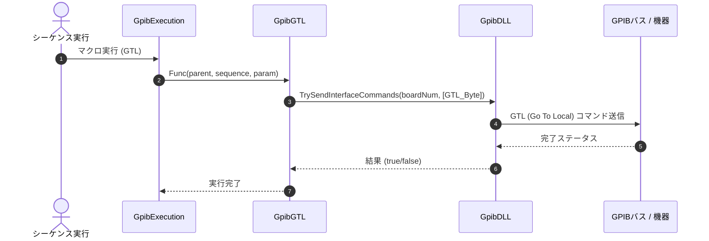

# コマンドリファレンス：GTL

## 概要
`GTL` は、対象デバイスに対して GTL（Go To Local：ローカル移行）マルチラインコマンドを送出し、機器の制御権をリモート状態（PC制御）からローカルパネル（前面パネルでの手動操作）へ安全に戻す物理通信・ライン制御系コマンドです。
自動測定マクロが正常終了した後に作業者が計測器を手動操作できるようにする場合や、エラー発生時に一時的に手動介入させたい場合のフロー制御として使用します。

> 💡 **補足 / ⚠️ 注意**
> リモート状態遷移、ローカル復帰の物理・UI制御は安全なクロススレッドアクセス（Invoke）を実装して一手に管理されているため、バックグラウンドでのマクロ実行時も安全に呼び出せます。

## 🔄 動作フロー（シーケンス図）
本コマンド実行時における、シーケンス実行エンジン（GpibExecution）、コマンドクラス（GpibGTL）、物理通信層（GpibDLL）、および接続機器間のインタラクションを示すシーケンス図です。



---

## 💡 書式・パラメータ仕様

```csv
,SEQUENCE, [ステップキー], GTL
```

### パラメータ（引数）一覧

本コマンドは実行にあたり引数を必要としません。コマンド名（`GTL`）を指定するだけで、対象デバイスに対してローカル移行コマンドを即座に送出します。

| 引数位置 | 引数名 | 説明 | 指定方法 / 有効な入力値 |
| :--- | :--- | :--- | :--- |
| — | — | なし（パラメータの指定は不要です）。 | — |

---

## 🔄 特殊置換規約・分岐規約の適用

本コマンドは引数を必要としないため、独自スクリプトの特殊記法の適用対象外です。

*   **動的置換（`$`）**: 引数を使用しないため、変数置換は使用しません。
*   **条件ジャンプ（`#`）**: 本コマンドはジャンプ処理を行わないため、引数内での `#` によるステップキー指定は使用しません。
*   **カンマのエスケープ**: 引数を持たないため、カンマのエスケープ規約は適用されません。

---

## 💡 動作例（正しい構文での記述例）

### スクリプト記述例
> ⚠️ **記述ルール注意**
> COMMANDブロック配下のため、子要素行（`PARAM`, `SEQUENCE`）は必ず行頭カンマから開始し、スペースインデントや行末コメント（`;`）は記述しないでください。コメントを入れる場合は、必ず独立したコメント行（行頭 `;`）を前に挟んでください。

```csv
COMMAND, "Measure_And_Release"
; データ格納用のワークエリアを定義
,PARAM, CH1_RAW, Work, "受信バッファ"
; 1. 配列バッファをメモリ上に初期化
,SEQUENCE, 10, Array_Init, CH1_RAW, 1, 20, ","
; 2. 測定コマンド送信と受信
,SEQUENCE, 20, Send, "MEAS:CURR?"
,SEQUENCE, 30, Receive
; 3. 自動計測が完了したため、機器のパネルロックを解除して手動操作に戻す
,SEQUENCE, 40, GTL
```

### 実行時の挙動・変数変化

*   **実行前の状態**: 機器がPCによるリモート制御（RENイネーブル状態）下にあり、前面パネルのボタン操作が排他ロックされている状態です。
*   **実行後の状態**: 対象機器にGTLコマンドが物理送出され、PC側からの制御ロックが解除されます。機器の前面パネルによる手動操作（ローカル状態）が可能になり、UIスレッド側でも連動して安全に状態が同期されます。

---

## 🚫 エラーハンドリング・安全設計（仕様制限）

入力データの異常や記述ミスに対し、解析・実行エンジンが実行するセーフティ規約です。

*   **非同期実行時のクロススレッドアクセスが発生した場合**
    マクロの実行エンジンが別スレッド（バックグラウンド）で動いている場合でも、内部で適切にUIスレッドへのディスパッチ（安全なクロススレッドアクセス：Invoke）をシームレスに行うため、スレッド間競合によるアプリケーションの異常強制終了を完全に防止します。
*   **オブジェクト欠損や通信層でのシステム例外が発生した場合**
    シーケンス情報のキャスト失敗時やメインフォーム参照がヌルである場合は、通信処理を走らせずに即座に安全に早期リターン（処理スキップ）します。また、通信切断等に伴う例外発生時も catch ブロックが確実に捕捉し、スタックトレースを含めてログ保存（`LogCritical`）を実行することで、エディタ全体の強制終了を自動防御します。

---

## 🧪 ユニットテスト仕様

本コマンドクラスに実装されている `RunUnitTest()` メソッドが検証するユニットテストの仕様です。

### テスト実行前提条件
* **実行トリガー**: `RunUnitTest()` メソッドの呼び出し
* **有効化条件**: システム全体の最小ログレベル（`ErrorLogger.MinimumLevel`）が `LogLevel.Test` であること（それ以外の場合は無効化ガードにより即座に早期リターン）
* **検証結果出力**: `ErrorLogger.LogTest` によるログ出力。検証失敗時は `ErrorLogger.LogError`、予期せぬ例外発生時は `ErrorLogger.LogCritical` で記録。

### テストケース一覧

| No | テストカテゴリ | テスト条件（入力値） | 期待される結果（出力値） | 検証の目的 / 観点 |
| :--- | :--- | :--- | :--- | :--- |
| **1** | 正常系 | `GetGtlButtonStatus()` メソッドを実行 | 戻り値: `ButtonStatus.Off` | GTL送信時に使用するボタンのステータス値（常に `Off`）が仕様通り取得されるかを検証。 |
