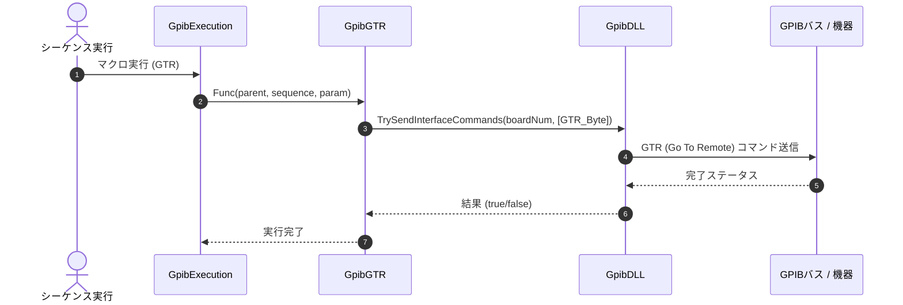

# コマンドリファレンス：GTR

## 概要
`GTR` は、対象デバイスに対して GTR（Go To Remote：リモート移行）物理信号およびステータス制御を送出し、機器の制御権を手動操作（ローカルパネル）からPCによる遠隔制御状態（リモート状態）へ安全に移行させる物理通信・ライン制御系コマンドです。
自動測定マクロの開始時に機器の前面パネルをロックして作業者の誤介入を防ぎたい場合や、設定コマンドの送信に先立って確実にリモート状態を確立したい場合に使用します。

> 💡 **補足 / ⚠️ 注意**
> リモート状態遷移、ローカル復帰、リモートイネーブル（REN/RDS）の物理・UI制御は、安全なクロススレッドアクセス（Invoke）を実装して一手に管理されているため、バックグラウンドでのマクロ実行時も安全に呼び出せます。

## 🔄 動作フロー（シーケンス図）
本コマンド実行時における、シーケンス実行エンジン（GpibExecution）、コマンドクラス（GpibGTR）、物理通信層（GpibDLL）、および接続機器間のインタラクションを示すシーケンス図です。



---

## 💡 書式・パラメータ仕様

```csv
,SEQUENCE, [ステップキー], GTR
```

### パラメータ（引数）一覧

本コマンドは実行にあたり引数を必要としません。コマンド名（`GTR`）を指定するだけで、対象デバイスをPC排他制御のリモート状態へと瞬時に移行させます。

| 引数位置 | 引数名 | 説明 | 指定方法 / 有効な入力値 |
| :--- | :--- | :--- | :--- |
| — | — | なし（パラメータの指定は不要です）。 | — |

---

## 🔄 特殊置換規約・分岐規約の適用

本コマンドは引数を必要としないため、独自スクリプトの特殊記法の適用対象外です。

*   **動的置換（`$`）**: 引数を使用しないため、変数置換は使用しません。
*   **条件ジャンプ（`#`）**: 本コマンドはジャンプ処理を行わないため、引数内での `#` によるステップキー指定は使用しません。
*   **カンマのエスケープ**: 引数を持たないため、カンマのエスケープ規約は適用されません。

---

## 💡 動作例（正しい構文での記述例）

### スクリプト記述例
> ⚠️ **記述ルール注意**
> COMMANDブロック配下のため、子要素行（`PARAM`, `SEQUENCE`）は必ず行頭カンマから開始し、スペースインデントや行末コメント（`;`）は記述しないでください。コメントを入れる場合は、必ず独立したコメント行（行頭 `;`）を前に挟んでください。

```csv
COMMAND, "Remote_Sampling"
; データ格納用のワークエリアを定義
,PARAM, CH1_RAW, Work, "データ格納用"
; 1. 機器をリモート状態（前面パネル操作ロック）へ移行
,SEQUENCE, 10, GTR
; 2. 設定の送信と測定データのパース受信
,SEQUENCE, 20, Send, "CONF:VOLT:DC"
,SEQUENCE, 30, Receive
; 3. 計測が完了したため、機器を手動操作状態に戻す
,SEQUENCE, 40, GTL
```

### 実行時の挙動・変数変化

*   **実行前の状態**: 機器が手動操作可能なローカル状態にあり、前面パネルのボタンが自由に操作できる状態です。
*   **実行後の状態**: 対象機器にGTRシグナルが物理送出され、PCによる排他制御（リモート状態）が確立されます。機器の前面パネルボタンが操作ロックされ、UIスレッド側でも連動して安全に状態が同期されます。

---

## 🚫 エラーハンドリング・安全設計（仕様制限）

入力データの異常や記述ミスに対し、解析・実行エンジンが実行するセーフティ規約です。

*   **非同期実行時のクロススレッドアクセスが発生した場合**
    マクロの実行スレッド（バックグラウンド）からの呼び出しに対し、内部で `InvokeRequired` を自動判定します。すべての下位UI更新処理をUIスレッド（メインフォーム）へ安全に同期・ディスパッチ（安全なクロススレッドアクセス：Invoke）するため、クロススレッドクラッシュを完全に防止します。
*   **ラムダ式内の参照型キャプチャ制限（C#仕様制限）への対策**
    C#コンパイラの制限（`ref` / `out` 引数を匿名デリゲート内で直接キャプチャできない仕様）によるビルドエラーや意図しないメモリリークを回避するため、内部で安全なローカルシャドウイング（変数のスコープキャプチャ最適化）を実装し、非同期実行時の動作安定性を担保しています。

---

## 🧪 ユニットテスト仕様

本コマンドクラスに実装されている `RunUnitTest()` メソッドが検証するユニットテストの仕様です。

### テスト実行前提条件
* **実行トリガー**: `RunUnitTest()` メソッドの呼び出し
* **有効化条件**: システム全体の最小ログレベル（`ErrorLogger.MinimumLevel`）が `LogLevel.Test` であること（それ以外の場合は無効化ガードにより即座に早期リターン）
* **検証結果出力**: `ErrorLogger.LogTest` によるログ出力。検証失敗時は `ErrorLogger.LogError`、予期せぬ例外発生時は `ErrorLogger.LogCritical` で記録。

### テストケース一覧

| No | テストカテゴリ | テスト条件（入力値） | 期待される結果（出力値） | 検証の目的 / 観点 |
| :--- | :--- | :--- | :--- | :--- |
| **1** | 正常系 | `ResolveButtonTargetStatus` に対し、<br>・`ButtonStatus.Flicker`, `isRemote = true`<br>・`ButtonStatus.Flicker`, `isRemote = false`<br>・`ButtonStatus.On`, `isRemote = false` | 戻り値:<br>・`ButtonStatus.Off`<br>・`ButtonStatus.On`<br>・`ButtonStatus.On` | `Flicker` 指定時に現在状態（リモート/ローカル）の反転ステータスが正しく解決されること、および直接状態指定（`On` 等）がそのまま維持されるかを検証。 |
| **2** | 正常系 | `GetNextRemoteStatus` に対し、<br>・`ButtonStatus.On` を入力<br>・`ButtonStatus.Off` を入力 | 戻り値:<br>・`RemoteStatusEnum.Remote`<br>・`RemoteStatusEnum.Local` | ボタンの状態（`On`/`Off`）から、遷移すべき `RemoteStatusEnum` の状態が正しくマッピングされるかを検証。 |
| **3** | 正常系 | `GetLloButtonUiState` に対し、<br>・`RemoteStatusEnum.Local` を入力<br>・`RemoteStatusEnum.LocalLockOut` を入力 | 戻り値:<br>・`Enabled` が `true`、`BackColor` が `Color.Gainsboro`<br>・`Enabled` が `false`、`BackColor` が `Color.Aqua` | `RemoteStatus` に応じた LLO ボタンの UI 制御表示状態（有効フラグ、背景色）が正しく取得できるかを検証。 |
| **4** | 正常系 | `GetGtlButtonUiState` に対し、<br>・`true` （リモート状態）を入力<br>・`false` （ローカル状態）を入力 | 戻り値:<br>・`BackColor` が `Color.Aqua`、`Text` が `"GTL"`<br>・`BackColor` が `Color.Gainsboro`、`Text` が `"GTR"` | リモート接続状況に応じた GTL/GTR ボタンのUI表示状態（背景色、テキスト）が正しく切り替わることを検証。 |
