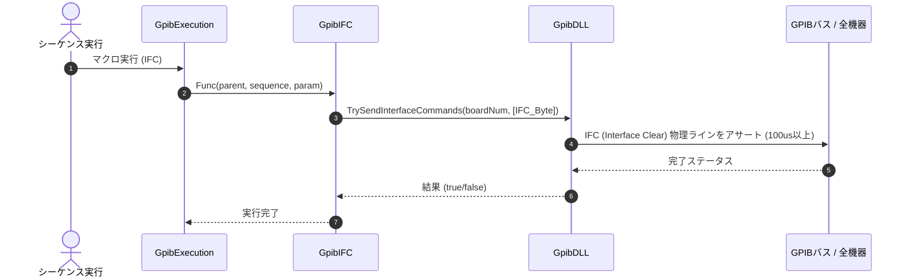

# コマンドリファレンス：IFC

## 概要
`IFC` は、GPIBコントローラ（ボード）からバス上のすべての接続機器に対して IFC（Interface Clear：インターフェースクリア）信号を物理送出し、バス全体のリセットおよび通信状態を物理レベルで強制初期化する物理通信・ライン制御系コマンドです。
バス上の機器がデータ送受信の途中でフリーズして通信が完全にロックしてしまった場合や、機器の電源再投入直後など、通信ハードウェアのハンドシェイク状態（Talker / Listener設定）を根本からクリアして正常な状態に戻すための最下層初期化処理として使用します。

> 💡 **補足 / ⚠️ 注意**
> 手動でメインフォーム上の `IFC` ボタンをクリックして実行した場合は、UI側のボタン配色が「Color.Aqua」へ一時変化し、1秒後に自動復帰する視覚効果が発生します。マクロスクリプトからの自動実行時は、このボタン配色の変化は発生しません。

## 🔄 動作フロー（シーケンス図）
本コマンド実行時における、シーケンス実行エンジン（GpibExecution）、コマンドクラス（GpibIFC）、物理通信層（GpibDLL）、および接続機器間のインタラクションを示すシーケンス図です。



---

## 💡 書式・パラメータ仕様

```csv
,SEQUENCE, [ステップキー], IFC
```

### パラメータ（引数）一覧

本コマンドは実行にあたり引数を必要としません。コマンド名（`IFC`）を指定するだけで、接続されているすべての物理ハードウェアインターフェースを一括リセットします。

| 引数位置 | 引数名 | 説明 | 指定方法 / 有効な入力値 |
| :--- | :--- | :--- | :--- |
| — | — | なし（パラメータの指定は不要です）。 | — |

---

## 🔄 特殊置換規約・分岐規約の適用

本コマンドは引数を必要としないため、独自スクリプトの特殊記法の適用対象外です。

*   **動的置換（`$`）**: 引数を使用しないため、変数置換は使用しません。
*   **条件ジャンプ（`#`）**: 本コマンドはジャンプ処理を行わないため、引数内での `#` によるステップキー指定は使用しません。
*   **カンマのエスケープ**: 引数を持たないため、カンマのエスケープ規約は適用されません。

---

## 💡 動作例（正しい構文での記述例）

### スクリプト記述例
> ⚠️ **記述ルール注意**
> COMMANDブロック配下のため、子要素行（`PARAM`, `SEQUENCE`）は必ず行頭カンマから開始し、スペースインデントや行末コメント（`;`）は記述しないでください。コメントを入れる場合は、必ず独立したコメント行（行頭 `;`）を前に挟んでください。

```csv
COMMAND, "Hardware_Recovery_Flow"
; データ格納用のワークエリアを定義
,PARAM, CH1_RAW, Work, "回収バッファ"
; 1. 物理レベルでGPIBバスのハンドシェイク状態を強制クリア
,SEQUENCE, 10, IFC
; 2. 機器内部のステータス・バッファを初期状態へ一括リセット
,SEQUENCE, 20, DCL
; 3. 配列バッファをメモリ上に再確保（カンマ区切り）
,SEQUENCE, 30, Array_Init, CH1_RAW, 1, 10, ","
; 4. 安全な状態から計測コマンドを再送信
,SEQUENCE, 40, Send, "READ?"
,SEQUENCE, 50, Receive
```

### 実行時の挙動・変数変化

*   **実行前の状態**: バス上の機器が応答を停止し、ハンドシェイクが固着してPC側からの通常通信が完全にハングアップしている状態です。
*   **実行後の状態**: バス全体へ物理層リセット（Interface Clear）がアサートされ、 Talker / Listener 設定が強制解放されます。通信ポートがクリーンな初期状態へと復旧します。（マクロからの自動実行時はボタンの背景色は変化しません）

---

## 🚫 エラーハンドリング・安全設計（仕様制限）

入力データの異常や記述ミスに対し、解析・実行エンジンが実行するセーフティ規約です。

*   **非同期実行時のクロススレッドアクセスが発生した場合**
    マクロ実行用のバックグラウンドスレッドから呼び出された場合でも、スレッド安全にメインフォームの `SendGpibIfcAsync()` が呼び出されるよう、実行エンジン内部で安全なクロススレッドアクセス（Invoke）が自動実行されます。これにより、アプリケーションの異常強制終了（クロススレッドクラッシュ）を完全に防止します。（なお、スレッド安全なカラー制御は手動UI操作時のみの処理となります）
*   **物理バスが重篤なハングアップ状態にある場合**
    物理層へのリセット処理は非同期タスクとして安全にキックされるため、バスが深刻な固着状態にあってもエディタ画面が「応答なし」状態（フリーズ）になるのを防止し、操作性を維持します。

---

## 🧪 ユニットテスト仕様

本コマンドクラスに実装されている `RunUnitTest()` メソッドが検証するユニットテストの仕様です。

### テスト実行前提条件
* **実行トリガー**: `RunUnitTest()` メソッドの呼び出し
* **有効化条件**: システム全体の最小ログレベル（`ErrorLogger.MinimumLevel`）が `LogLevel.Test` であること（それ以外の場合は無効化ガードにより即座に早期リターン）
* **検証結果出力**: `ErrorLogger.LogTest` によるログ出力。検証失敗時は `ErrorLogger.LogError`、予期せぬ例外発生時は `ErrorLogger.LogCritical` で記録。

### テストケース一覧

| No | テストカテゴリ | テスト条件（入力値） | 期待される結果（出力値） | 検証の目的 / 観点 |
| :--- | :--- | :--- | :--- | :--- |
| **1** | 正常系 | `CanSendIfc` に対し、<br>・`true` を入力<br>・`false` を入力 | 戻り値:<br>・`true` 入力時は `true`<br>・`false` 入力時は `false` | 回線接続状態（オープン/クローズ）に基づき、IFC送信の可否が正しく判定されるかを検証。 |
| **2** | 正常系 | `GetButtonUiState` に対し、<br>・`true` （処理中）を入力<br>・`false` （非処理中）を入力 | 戻り値:<br>・`true` 入力時は `Enabled` が `false`、`BackColor` が `Color.Aqua`<br>・`false` 入力時は `Enabled` が `true` , `BackColor` が `Color.Gainsboro` | 送信処理状態に応じたIFCボタンのUI制御状態（有効化フラグ、背景色）が正しく取得できるかを検証。 |
