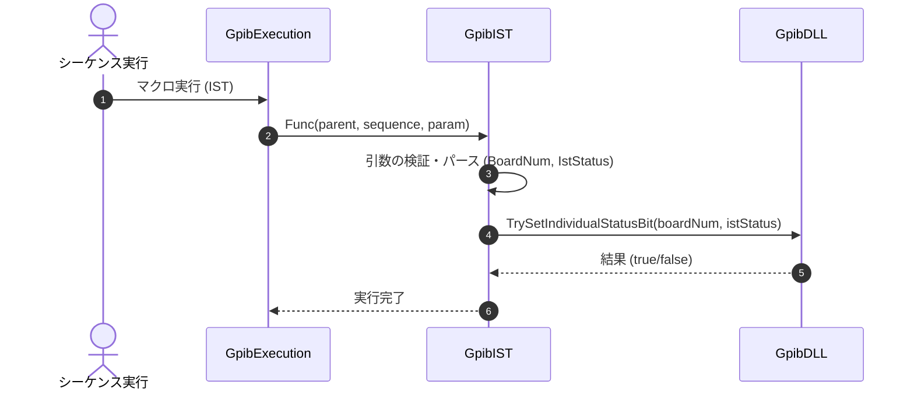

# コマンドリファレンス：IST

## 概要
`IST` は、指定されたボードに対して、個別ステータスビット（ist）の状態を設定するためのコマンドです。これはパラレルポーリングの応答における装置側の応答ビット制御の基礎値として使用されます。

## 🔄 動作フロー（シーケンス図）
本コマンド実行時における、シーケンス実行エンジン（GpibExecution）、コマンドクラス（GpibIST）、および物理通信層（GpibDLL）間のインタラクションを示すシーケンス図です。



---

## 💡 書式・パラメータ仕様

```csv
,SEQUENCE, [ステップキー], IST, [ボード番号], [ist値(1/0)]
```

### パラメータ（引数）一覧

| 引数位置 | 引数名 | 説明 | 指定方法 / 有効な入力値 |
| :--- | :--- | :--- | :--- |
| **引数1** | ボード番号 | 設定を行うGPIBボードの番号。 | 整数（例: `"0"`）またはパラメータ動的置換 |
| **引数2** | ist値(1/0) | 設定する個別ステータスビット（ist）の状態。 | `"1"` (または `"true"`) で有効、`"0"` (または `"false"`) で無効 |

---

## 🔄 特殊置換規約・分岐規約の適用
*   **動的置換（`$`）**: 引数において `$PARAMキー$` を用いた変数置換が可能です。

---

## 🚫 エラーハンドリング・安全設計
*   引数不足やボード番号のパース失敗時には、エラーログを出力して処理を安全に早期リターン（処理スキップ）します。
