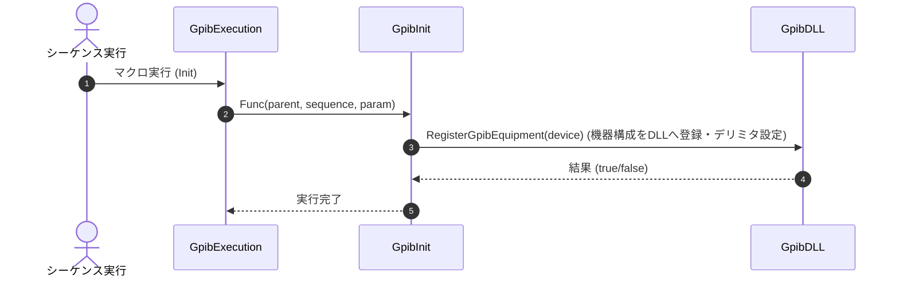

# コマンドリファレンス：Init

## 概要
`Init` は、対象機器のオブジェクト情報を通信DLLへ安全に登録し、構成ファイルから読み込まれた終端識別文字（デリミタ）設定をハードウェア層へ物理同期・適用する物理通信・ライン制御系コマンドです。
マクロシーケンスの開始時や、物理層の回線接続（`Open`）を実行した直後に呼び出し、PCと計測器の間で正しいテキストデータの送受信を行える状態を確定させるために使用します。

> 💡 **補足 / ⚠️ 注意**
> デリミタの設定は、構成ファイルで定義された識別子（`0:なし`, `1:CRLF`, `2:CR`, `3:LF`）に基づいてハードウェア層へ物理的に適用されます。

## 🔄 動作フロー（シーケンス図）
本コマンド実行時における、シーケンス実行エンジン（GpibExecution）、コマンドクラス（GpibInit）、および物理通信層（GpibDLL）間のインタラクションを示すシーケンス図です。



---

## 💡 書式・パラメータ仕様

```csv
,SEQUENCE, [ステップキー], Init
```

### パラメータ（引数）一覧

本コマンドは実行にあたり引数を必要としません。解析エンジンが現在処理している文脈上の機器情報を自動で追跡し、物理初期化を実行します。

| 引数位置 | 引数名 | 説明 | 指定方法 / 有効な入力値 |
| :--- | :--- | :--- | :--- |
| — | — | なし（パラメータの指定は不要です）。 | — |

---

## 🔄 特殊置換規約・分岐規約の適用

本コマンドは引数を必要としないため、独自スクリプトの特殊記法の適用対象外です。

*   **動的置換（`$`）**: 引数を使用しないため、変数置換は使用しません。
*   **条件ジャンプ（`#`）**: 本コマンドはジャンプ処理を行わないため、引数内での `#` によるステップキー指定は使用しません。
*   **カンマのエスケープ**: 引数を持たないため、カンマのエスケープ規約は適用されません。

---

## 💡 動作例（正しい構文での記述例）

### スクリプト記述例
> ⚠️ **記述ルール注意**
> `TITLE` ブロックおよび `COMMAND` ブロック配下の子要素行は、必ず行頭カンマから開始し、スペースインデントや行末コメント（`;`）は記述しないでください。コメントを入れる場合は、必ず独立したコメント行（行頭 `;`）を前に挟んでください。

```csv
TITLE, "HP_3458A"
,DEVICEBOARD, 0
,DEVICEADDRESS1ST, 22
,DEVICEADDRESS2ND, -1
,DELIMITER, 1
,EOI, true

COMMAND, "Hardware_Establish_Flow"
; 1. 物理接続を開く
,SEQUENCE, 10, Open
; 2. 読み込まれた設定（デリミタ等）をハードウェア層へ物理同期・適用
,SEQUENCE, 20, Init
; 3. 通信が確立したため、機器内部バッファを一括クリア
,SEQUENCE, 40, DCL
; 4. 機器をリモート状態（パネルロック）へ移行
,SEQUENCE, 50, GTR
```

### 実行時の挙動・変数変化

*   **実行前の状態**: 物理的な回線（`Open`）は開いているものの、通信DLLへのオブジェクト情報や終端識別文字（デリミタ）の同期がまだ完了していない状態です。
*   **実行後の状態**: 対象機器の情報が通信DLLへ安全に登録され、構成ファイルで定義された終端文字設定（例：`1:CRLF`）がハードウェア層へ適用されます。送受信時の文字化けやハングアップを防ぐ基盤が確立されます。

---

## 🚫 エラーハンドリング・安全設計（仕様制限）

入力データの異常や記述ミスに対し、解析・実行エンジンが実行するセーフティ規約です。

*   **デリミタ同期時またはDLL層で設定書き込みに失敗した場合**
    設定の適用は内部的にTry構造（`TrySetDelimiterConfig` 等）で保護されています。アドレス競合や物理的な結線不良によってDLL層への設定書き込みに失敗した場合でも、システムは呼び出し元を巻き込んで異常強制終了（例外発生）させず、エラーフラグを捕捉して安全に後続のステップへ処理を繋ぎます。

---

## 🧪 ユニットテスト仕様

本コマンドクラスに実装されている `RunUnitTest()` メソッドが検証するユニットテストの仕様です。

### テスト実行前提条件
* **実行トリガー**: `RunUnitTest()` メソッドの呼び出し
* **有効化条件**: システム全体の最小ログレベル（`ErrorLogger.MinimumLevel`）が `LogLevel.Test` であること（それ以外の場合は無効化ガードにより即座に早期リターン）
* **検証結果出力**: `ErrorLogger.LogTest` によるログ出力。検証失敗時は `ErrorLogger.LogError`、予期せぬ例外発生時は `ErrorLogger.LogCritical` で記録。

### テストケース一覧

| No | テストカテゴリ | テスト条件（入力値） | 期待される結果（出力値） | 検証の目的 / 観点 |
| :--- | :--- | :--- | :--- | :--- |
| **1** | 正常系 | `CanInitialize` に対し、`null` を入力 | 戻り値: `false` | デバイス情報が `null` の場合に、初期化処理の実行不可判定が正しく行われるかを検証。 |
| **2** | 正常系 | `CanInitialize` に対し、インスタンス化された `GpibDevice` オブジェクトを入力 | 戻り値: `true` | 有効なデバイス情報が存在する場合に、初期化処理の実行可能判定が正しく行われるかを検証。 |
