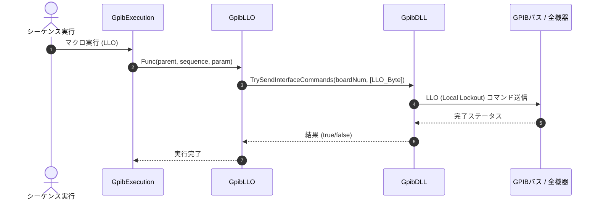

# コマンドリファレンス：LLO

## 概要
`LLO` は、GPIBバス上の機器に対して LLO（Local Lockout：ローカルロックアウト）マルチラインコマンドを送出し、計測器の前面パネルのボタン手動介入を完全禁止する物理通信・ライン制御系コマンドです。
自動測定マクロの実行中に、作業者が誤って計測器のボタンに触れて設定が変わってしまう事故や、パネル操作による通信タイミングの破壊（ハングアップ）を未然に防ぐための排他制御として使用します。

> 💡 **補足 / ⚠️ 注意**
> 本コマンドを発行すると、通常のリモート状態（`GTR`）では解放可能な「Local」ボタンを含め、計測器側のすべての前面パネル操作が物理的に受け付けなくなります。ロック解除には `GTL` コマンドの発行が必要です。

## 🔄 動作フロー（シーケンス図）
本コマンド実行時における、シーケンス実行エンジン（GpibExecution）、コマンドクラス（GpibLLO）、物理通信層（GpibDLL）、および接続機器間のインタラクションを示すシーケンス図です。



---

## 💡 書式・パラメータ仕様

```csv
,SEQUENCE, [ステップキー], LLO
```

### パラメータ（引数）一覧

本コマンドは実行にあたり引数を必要としません。コマンド名（`LLO`）を指定するだけで、対象デバイスに対してローカルロックアウト信号を即座に送出します。

| 引数位置 | 引数名 | 説明 | 指定方法 / 有効な入力値 |
| :--- | :--- | :--- | :--- |
| — | — | なし（パラメータの指定は不要です）。 | — |

---

## 🔄 特殊置換規約・分岐規約の適用

本コマンドは引数を必要としないため、独自スクリプトの特殊記法の適用対象外です。

*   **動的置換（`$`）**: 引数を使用しないため、変数置換は使用しません。
*   **条件ジャンプ（`#`）**: 本コマンドはジャンプ処理を行わないため、引数内での `#` によるステップキー指定は使用しません。
*   **カンマのエスケープ**: 引数を持たないため、カンマのエスケープ規約は適用されません。

---

## 💡 動作例（正しい構文での記述例）

### スクリプト記述例
> ⚠️ **記述ルール注意**
> COMMANDブロック配下のため、子要素行（`PARAM`, `SEQUENCE`）は必ず行頭カンマから開始し、スペースインデントや行末コメント（`;`）は記述しないでください。コメントを入れる場合は、必ず独立したコメント行（行頭 `;`）を前に挟んでください。

```csv
COMMAND, "Secure_Automated_Run"
; データ格納用のワークエリアを定義
,PARAM, CH1_RAW, Work, "計測バッファ"
; 1. 機器をリモート制御状態へ移行
,SEQUENCE, 10, GTR
; 2. 前面パネルのボタン手動介入を完全禁止（物理ロック）
,SEQUENCE, 20, LLO
; 3. 計測コマンド送信とデータ受信
,SEQUENCE, 30, Send, "READ?"
,SEQUENCE, 40, Receive
; 4. 計測完了後、GTLを発行してパネルロックの解除とローカル復帰を同時に行う
,SEQUENCE, 50, GTL
```

### 実行時の挙動・変数変化

*   **実行前の状態**: 機器がPCによるリモート制御下（`GTR`状態）にあるものの、前面パネルの「Local」ボタンを押すことで作業者が手動介入できてしまう状態です。
*   **実行後の状態**: 対象機器に`LLO`コマンドが物理送出され、前面パネルの操作が完全にロックされます。UIスレッド側では連動して `StsLLOBtn()` が実行され、ロック状態である間は専用ボタンの背景色が水色（`Color.Aqua`）に変化・維持されます。その後、`GTL` コマンド等の発行によってロックが解除されたタイミングで自動的に元の配色（`Color.Gainsboro`）へ復帰し、安全なクロススレッドアクセス（Invoke）を介して状態が同期されます。

---

## 🚫 エラーハンドリング・安全設計（仕様制限）

入力データの異常や記述ミスに対し、解析・実行エンジンが実行するセーフティ規約です。

*   **非同期実行時のクロススレッドアクセスが発生した場合**
    マクロの実行エンジンが別スレッド（バックグラウンド）で動いている場合でも、内部で適切にUIスレッドへのディスパッチ（安全なクロススレッドアクセス：Invoke）を自動判定してシームレスに行うため、クロススレッドクラッシュを完全に防止します。
*   **オブジェクト欠損や通信層でのシステム例外が発生した場合**
    シーケンス情報のキャスト失敗時やメインフォーム参照がヌルである場合は、通信処理を走らせずに即座に安全に早期リターン（処理スキップ）します。また、通信切断等に伴う例外発生時も catch ブロックが確実に捕捉し、スタックトレースを含めてログ保存（`LogCritical`）を実行することで、エディタ全体の強制終了を自動防御します。

---

## 🧪 ユニットテスト仕様

本コマンドクラスに実装されている `RunUnitTest()` メソッドが検証するユニットテストの仕様です。

### テスト実行前提条件
* **実行トリガー**: `RunUnitTest()` メソッドの呼び出し
* **有効化条件**: システム全体の最小ログレベル（`ErrorLogger.MinimumLevel`）が `LogLevel.Test` であること（それ以外の場合は無効化ガードにより即座に早期リターン）
* **検証結果出力**: `ErrorLogger.LogTest` によるログ出力。検証失敗時は `ErrorLogger.LogError`、予期せぬ例外発生時は `ErrorLogger.LogCritical` で記録。

### テストケース一覧

| No | テストカテゴリ | テスト条件（入力値） | 期待される結果（出力値） | 検証の目的 / 観点 |
| :--- | :--- | :--- | :--- | :--- |
| **1** | 正常系 | `CanSendLlo` に対し、`true` を入力 | 戻り値: `true` | 回線接続時に LLO 送信が可能と判定されるかを検証。 |
| **2** | 正常系 | `CanSendLlo` に対し、`false` を入力 | 戻り値: `false` | 回線未接続時に LLO 送信が不可と判定されるかを検証。 |
