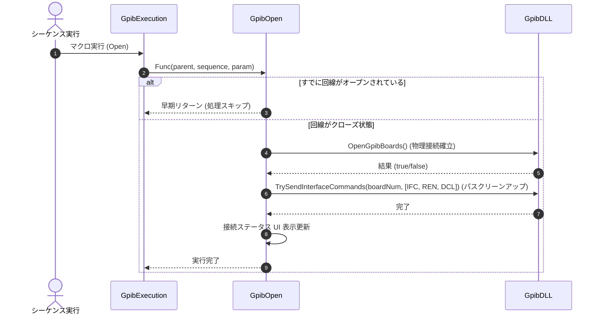

# コマンドリファレンス：Open

## 概要
`Open` は、GPIB物理層の回線接続（オープン）を実行し、バス全体のクリーン化および通信インターフェースとUIを一括で活性化させる物理通信・ライン制御系コマンドです。
すべての自動測定シーケンスの最上流、または計測器への接続が切断された状態から通信を再開する際の最上流処理として使用します。

> 💡 **補足 / ⚠️ 注意**
> `Open` 実行時は `IFC / REN / DCL` を一斉送出してバスをクリーンにします。すでに回線がオープンしている場合は、通信層の初期化を重複して走らせず安全に早期リターン（処理スキップ）します。

## 🔄 動作フロー（シーケンス図）
本コマンド実行時における、シーケンス実行エンジン（GpibExecution）、コマンドクラス（GpibOpen）、および物理通信層（GpibDLL）間のインタラクションを示すシーケンス図です。



---

## 💡 書式・パラメータ仕様

```csv
,SEQUENCE, [ステップキー], Open
```

### パラメータ（引数）一覧

本コマンドは実行にあたり引数を必要としません。コマンド名（`Open`）を指定するだけで、システムが保持するGPIBボードのハードウェア接続と初期化プロセスを一括で自動実行します。

| 引数位置 | 引数名 | 説明 | 指定方法 / 有効な入力値 |
| :--- | :--- | :--- | :--- |
| — | — | なし（パラメータの指定は不要です）。 | — |

---

## 🔄 特殊置換規約・分岐規約の適用

本コマンドは引数を必要としないため、独自スクリプトの特殊記法の適用対象外です。

*   **動的置換（`$`）**: 引数を使用しないため、変数置換は使用しません。
*   **条件ジャンプ（`#`）**: 本コマンドはジャンプ処理を行わないため、引数内での `#` によるステップキー指定は使用しません。
*   **カンマのエスケープ**: 引数を持たないため、カンマのエスケープ規約は適用されません。

---

## 💡 動作例（正しい構文での記述例）

### スクリプト記述例
> ⚠️ **記述ルール注意**
> `TITLE` ブロックおよび `COMMAND` ブロック配下の子要素行は、必ず行頭カンマから開始し、スペースインデントや行末コメント（`;`）は記述しないでください。コメントを入れる場合は、必ず独立したコメント行（行頭 `;`）を前に挟んでください。

```csv
COMMAND, "Establish_Connection"
; 1. 最上流で物理接続を開き、バスをクリーン化する
,SEQUENCE, 10, Open
; 2. 続いて構成ファイルの設定（デリミタ等）をハードウェアへ同期
,SEQUENCE, 20, Init
```

### 実行時の挙動・変数変化

*   **実行前の状態**: GPIB回線が完全に切断されており、メイン画面上の接続インジケータ（赤点灯）およびバックグラウンドの監視タイマーが停止している状態です。
*   **実行後の状態**: OSレベルのGPIBハンドルが確保され、物理層へ `IFC / REN / DCL` が一斉送出されます。バス上のすべてのトークンがクリアされるとともに、UI側の接続インジケータが「接続中（緑色）」へと同期し、バックグラウンドでの接続時間計測タイマーが安全に稼働します。

---

## 🚫 エラーハンドリング・安全設計（仕様制限）

入力データの異常や記述ミスに対し、解析・実行エンジンが実行するセーフティ規約です。

*   **非同期実行時のクロススレッドアクセスが発生した場合**
    マクロの実行エンジン（バックグラウンドスレッド）から呼び出された場合でも、内部で自動的に `InvokeRequired` 判定を行います。UIスレッドへの安全なクロススレッドアクセス（Invoke）を行うことで、画面のフリーズやクロススレッドクラッシュを完全に防止します。
*   **物理オープン（ハードウェア接続）に失敗した場合**
    GPIBコントローラの電源遮断などによりボードの物理オープンに失敗した場合、システムは例外でクラッシュせず、内部ログ（`LogError`）にエラー内容を出力してバグを安全に捕捉し、該当ステップをスキップ（早期リターン）します。

---

## 🧪 ユニットテスト仕様

本コマンドクラスに実装されている `RunUnitTest()` メソッドが検証するユニットテストの仕様です。

### テスト実行前提条件
* **実行トリガー**: `RunUnitTest()` メソッドの呼び出し
* **有効化条件**: システム全体の最小ログレベル（`ErrorLogger.MinimumLevel`）が `LogLevel.Test` であること（それ以外の場合は無効化ガードにより即座に早期リターン）
* **検証結果出力**: `ErrorLogger.LogTest` によるログ出力。検証失敗時は `ErrorLogger.LogError`、予期せぬ例外発生時は `ErrorLogger.LogCritical` で記録。

### テストケース一覧

| No | テストカテゴリ | テスト条件（入力値） | 期待される結果（出力値） | 検証の目的 / 観点 |
| :--- | :--- | :--- | :--- | :--- |
| **1** | 正常系 | `GetConnectionStates` に対し、`true` （オープン成功）を入力 | 戻り値:<br>・`MenuChecked` が `true`<br>・`RenStatus` が `ButtonStatus.On`<br>・`UseGreenLed` が `true` | 回線接続（オープン）成功時におけるUI制御用の戻り値が仕様通り正しく設定されているかを検証。 |
| **2** | 正常系 | `GetConnectionStates` に対し、`false` （オープン失敗）を入力 | 戻り値:<br>・`MenuChecked` が `false`<br>・`RenStatus` が `ButtonStatus.Off`<br>・`UseGreenLed` が `false` | 回線接続（オープン）失敗時におけるUI制御用の戻り値が仕様通り正しく設定されているかを検証。 |
