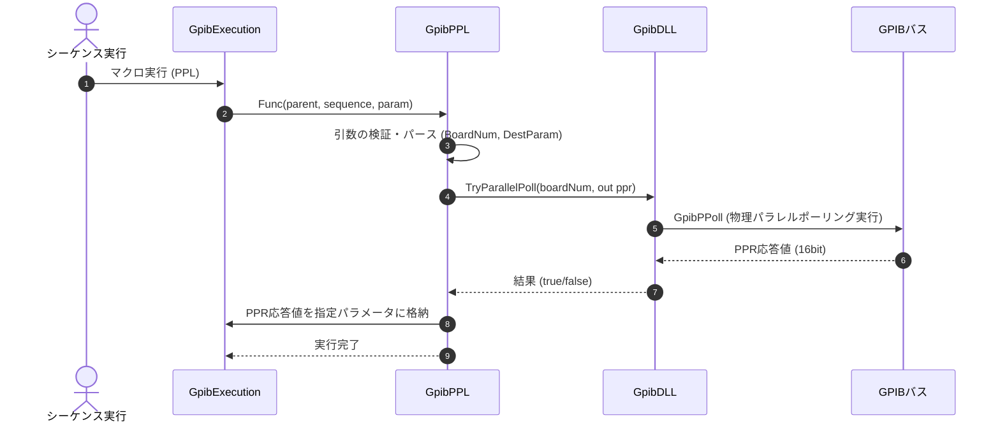

# コマンドリファレンス：PPL

## 概要
`PPL` は、指定されたボードからパラレルポーリング（Parallel Poll）を一斉実行し、バス上の全機器の応答集約値（PPR値）を物理取得してマクロ変数に格納するためのコマンドです。

## 🔄 動作フロー（シーケンス図）
本コマンド実行時における、シーケンス実行エンジン（GpibExecution）、コマンドクラス（GpibPPL）、物理通信層（GpibDLL）、および接続機器間のインタラクションを示すシーケンス図です。



---

## 💡 書式・パラメータ仕様

```csv
,SEQUENCE, [ステップキー], PPL, [ボード番号], [格納先変数]
```

### パラメータ（引数）一覧

| 引数位置 | 引数名 | 説明 | 指定方法 / 有効な入力値 |
| :--- | :--- | :--- | :--- |
| **引数1** | ボード番号 | パラレルポーリングを実行するGPIBボードの番号。 | 整数（例: `"0"`）またはパラメータ動的置換 |
| **引数2** | 格納先変数 | 取得したパラレルポーリング応答値（PPR値、16ビット整数）を格納するパラメータキー。 | 変数プール（PARAM）に定義されているキー名（例: `PP_RESULT`） |

---

## 🔄 特殊置換規約・分岐規約の適用
*   **動的置換（`$`）**: 引数において `$PARAMキー$` を用いた変数置換が可能です。

---

## 🚫 エラーハンドリング・安全設計
*   引数不足やボード番号のパース失敗時には、エラーログを出力して早期リターンします。
*   物理層エラーによりパラレルポーリングが失敗した場合は、エラーログを書き出し、格納先変数は更新しません。
