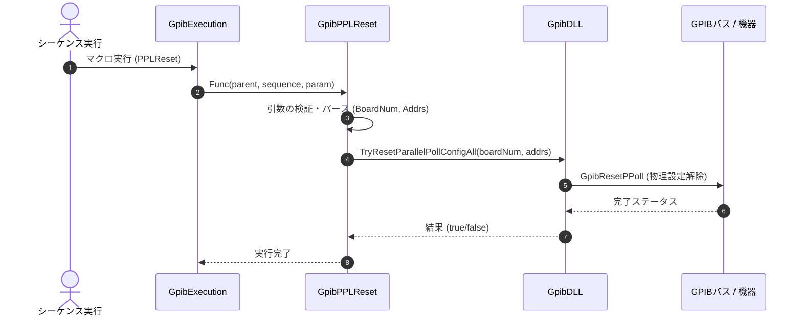

# コマンドリファレンス：PPLReset

## 概要
`PPLReset` は、指定された複数の装置に対して、パラレルポーリングの応答設定を一括で安全に物理解除（リセット）するためのコマンドです。

## 🔄 動作フロー（シーケンス図）
本コマンド実行時における、シーケンス実行エンジン（GpibExecution）、コマンドクラス（GpibPPLReset）、物理通信層（GpibDLL）、および接続機器間のインタラクションを示すシーケンス図です。



---

## 💡 書式・パラメータ仕様

```csv
,SEQUENCE, [ステップキー], PPLReset, [ボード番号], [宛先アドレスリスト]
```

### パラメータ（引数）一覧

| 引数位置 | 引数名 | 説明 | 指定方法 / 有効な入力値 |
| :--- | :--- | :--- | :--- |
| **引数1** | ボード番号 | 設定解除を行うGPIBボードの番号。 | 整数（例: `"0"`）またはパラメータ動的置換 |
| **引数2** | 宛先アドレスリスト | 解除対象とする機器のプライマリアドレス。カンマ区切りで複数指定可能。 | カンマ区切りの文字列（例: `"1,2"`） |

---

## 🔄 特殊置換規約・分岐規約の適用
*   **動的置換（`$`）**: 引数において `$PARAMキー$` を用いた変数置換が可能です。
*   **カンマのエスケープ**: 引数にカンマを含める場合は二重引用符で囲んでください。

---

## 🚫 エラーハンドリング・安全設計
*   引数不足やパース失敗時には、エラーログを出力して処理を安全に早期リターン（処理スキップ）します。
*   物理層エラーにより設定解除が失敗した場合は、内部エラーログにエラー内容を出力します。
