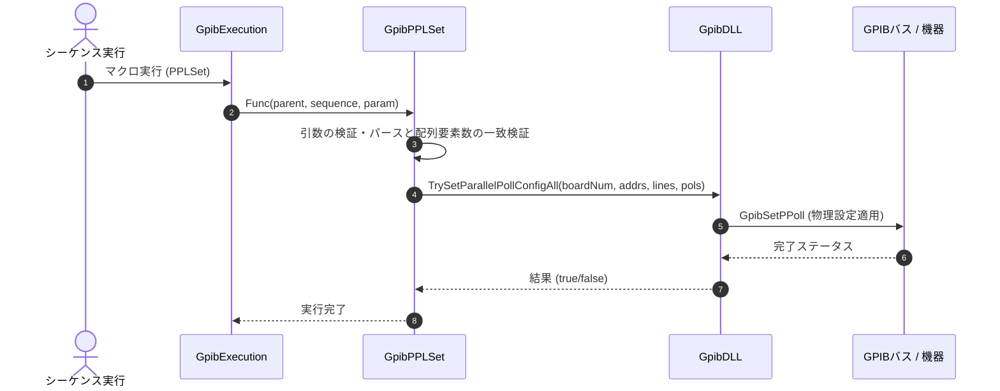

# コマンドリファレンス：PPLSet

## 概要
`PPLSet` は、指定されたボードに接続されている複数の装置に対して、パラレルポーリングの応答設定（応答を行うデータラインおよび応答極性）を一括で安全に物理設定するためのコマンドです。

## 🔄 動作フロー（シーケンス図）
本コマンド実行時における、シーケンス実行エンジン（GpibExecution）、コマンドクラス（GpibPPLSet）、物理通信層（GpibDLL）、および接続機器間のインタラクションを示すシーケンス図です。



---

## 💡 書式・パラメータ仕様

```csv
,SEQUENCE, [ステップキー], PPLSet, [ボード番号], [宛先アドレスリスト], [データラインリスト], [極性リスト]
```

### パラメータ（引数）一覧

| 引数位置 | 引数名 | 説明 | 指定方法 / 有効な入力値 |
| :--- | :--- | :--- | :--- |
| **引数1** | ボード番号 | 設定を行うGPIBボードの番号。 | 整数（例: `"0"`）またはパラメータ動的置換 |
| **引数2** | 宛先アドレスリスト | 設定対象とする機器のプライマリアドレス。カンマ区切りで複数指定。 | カンマ区切りの文字列（例: `"1,2"`） |
| **引数3** | データラインリスト | 各機器に割り当てる応答データライン（DIO1〜DIO8）。カンマ区切り。 | カンマ区切りの整数列（例: `"1,2"`） |
| **引数4** | 極性リスト | 各機器の応答極性（1:正論理, 0:負論理）。カンマ区切り。 | カンマ区切りの二値数列（例: `"1,0"`） |

---

## 🔄 特殊置換規約・分岐規約の適用
*   **動的置換（`$`）**: 引数において `$PARAMキー$` を用いた変数置換が可能です。
*   **カンマのエスケープ**: 引数にカンマを含める場合は二重引用符で囲んでください。

---

## 🚫 エラーハンドリング・安全設計
*   引数不足やパース失敗、あるいは「アドレス・ライン・極性」の配列要素数が一致しない場合は、エラーログを出力して処理を安全にスキップします。
*   **Interface製ドライバー（GPC4304.DLL）環境における動作制限**  
    Interface製ドライバー使用時は、パラレルポーリングの割り当てに `PciGpibExCfgPpoll` を使用しますが、内部で極性およびデータラインの設定として `0x09` の固定値が適用される簡易実装となっています。そのため、マクロ引数で指定された「データラインリスト（引数3）」および「極性リスト（引数4）」のパラメータは実質的に無視され適用されませんのでご注意ください。

