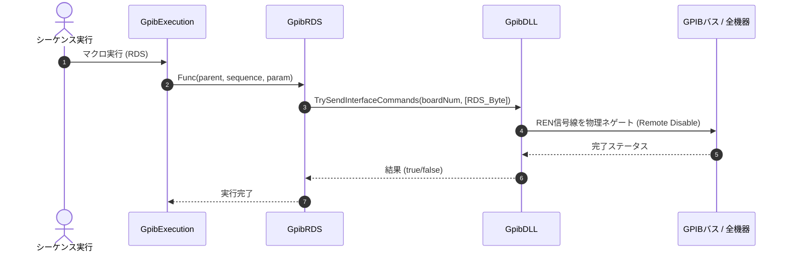

# コマンドリファレンス：RDS

## 概要
`RDS` は、対象デバイスに対して RDS（Remote Disabled：リモート無効化）制御を送出し、コントローラ（ボード）が発信しているリモート・イネーブル（REN）信号線を物理的に不活性化（オフ）にすることで、バス上のすべての機器を強制的にローカル手動操作状態に戻す物理通信・ライン制御系コマンドです。
マクロシーケンスの完全終了時や、システムエラー・緊急停止時にPCからの遠隔制御を安全にカットし、作業者が機器の前面パネルを即座に手動操作できるように復帰させるためのマスターリセット層として使用します。

> 💡 **補足 / ⚠️ 注意**
> 単一の機器に対してローカル移行を促す `GTL` コマンドとは異なり、コントローラが駆動している REN 信号線そのものをオフにするため、バス上に接続されているすべての計測器のリモート状態（前面パネルのボタン操作ロック）が一括で強制解除されます。

## 🔄 動作フロー（シーケンス図）
本コマンド実行時における、シーケンス実行エンジン（GpibExecution）、コマンドクラス（GpibRDS）、物理通信層（GpibDLL）、および接続機器間のインタラクションを示すシーケンス図です。



---

## 💡 書式・パラメータ仕様

```csv
,SEQUENCE, [ステップキー], RDS
```

### パラメータ（引数）一覧

本コマンドは実行にあたり引数を必要としません。コマンド名（`RDS`）を指定するだけで、バス全体の REN ラインを即座に不活性化（オフ）にします。

| 引数位置 | 引数名 | 説明 | 指定方法 / 有効な入力値 |
| :--- | :--- | :--- | :--- |
| — | — | なし（パラメータの指定は不要です）。 | — |

---

## 🔄 特殊置換規約・分岐規約の適用

本コマンドは引数を必要としないため、独自スクリプトの特殊記法の適用対象外です。

*   **動的置換（`$`）**: 引数を使用しないため、変数置換は使用しません。
*   **条件ジャンプ（`#`）**: 本コマンドはジャンプ処理を行わないため、引数内での `#` によるステップキー指定は使用しません。
*   **カンマのエスケープ**: 引数を持たないため、カンマのエスケープ規約は適用されません。

---

## 💡 動作例（正しい構文での記述例）

### スクリプト記述例
> ⚠️ **記述ルール注意**
> COMMANDブロック配下のため、子要素行（`PARAM`, `SEQUENCE`）は必ず行頭カンマから開始し、スペースインデントや行末コメント（`;`）は記述しないでください。コメントを入れる場合は、必ず独立したコメント行（行頭 `;`）を前に挟んでください。

```csv
COMMAND, "Final_Release_Flow"
; データ格納用のワークエリアを定義
,PARAM, CH1_RAW, Work, "受信バッファ"
; 1. 測定コマンド送信と受信
,SEQUENCE, 10, Send, "FETCH?"
,SEQUENCE, 20, Receive
; 2. 外部ファイルログストリームの一括クローズ
,SEQUENCE, 30, LogOut
; 3. すべての自動工程が完了したため、バスのRENラインをOffにして全機器を一括ローカル復帰
,SEQUENCE, 40, RDS
```

### 実行時の挙動・変数変化

*   **実行前の状態**: バス上の接続機器がPCによる遠隔制御（RENイネーブル状態）下にあり、前面パネルのボタン手動介入が禁止（ロックアウトなどを含む）されている状態です。
*   **実行後の状態**: コントローラからの REN 物理シグナルが遮断されます。バス上のすべての機器のパネルロックが一括解除されて手動操作可能なローカル状態へ遷移し、UI制御層の管理状態も一貫して安全に同期されます。

---

## 🚫 エラーハンドリング・安全設計（仕様制限）

入力データの異常や記述ミスに対し、解析・実行エンジンが実行するセーフティ規約です。

*   **非同期実行時のクロススレッドアクセスが発生した場合**
    マクロの実行エンジンが別スレッド（バックグラウンドスレッド）で動いている場合でも、内部のインフラ関数（`BtnRENSend`）がUIスレッドへの適切なディスパッチ（安全なクロススレッドアクセス：Invoke）を自動で連動させ、クロススレッドクラッシュを完全に防止します。
*   **オブジェクト欠損や通信層でのシステム例外が発生した場合**
    シーケンス情報のキャスト失敗時やメインフォーム参照がヌルである場合は、通信処理を実行せずに即座に安全に早期リターン（処理スキップ）します。また、通信切断等に伴う例外発生時も catch ブロックが確実に捕捉し、スタックトレースを含めてログ保存（`LogCritical`）を実行することで、エディタ全体の強制終了を自動防御します。

---

## 🧪 ユニットテスト仕様

本コマンドクラスに実装されている `RunUnitTest()` メソッドが検証するユニットテストの仕様です。

### テスト実行前提条件
* **実行トリガー**: `RunUnitTest()` メソッドの呼び出し
* **有効化条件**: システム全体の最小ログレベル（`ErrorLogger.MinimumLevel`）が `LogLevel.Test` であること（それ以外の場合は無効化ガードにより即座に早期リターン）
* **検証結果出力**: `ErrorLogger.LogTest` によるログ出力。検証失敗時は `ErrorLogger.LogError`、予期せぬ例外発生時は `ErrorLogger.LogCritical` で記録。

### テストケース一覧

| No | テストカテゴリ | テスト条件（入力値） | 期待される結果（出力値） | 検証の目的 / 観点 |
| :--- | :--- | :--- | :--- | :--- |
| **1** | 正常系 | `GetRdsButtonStatus()` メソッドを実行 | 戻り値: `ButtonStatus.Off` | RDS送信時に使用するボタンのステータス値（常に `Off`）が仕様通り取得されるかを検証。 |
