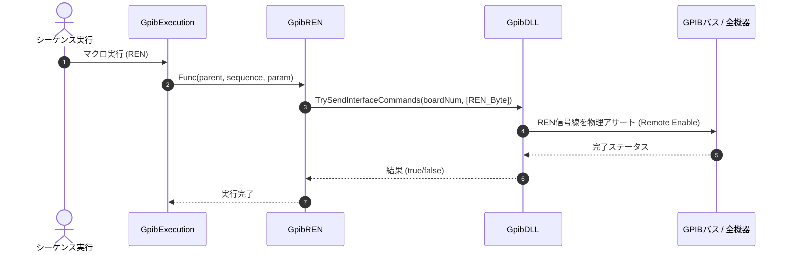

# コマンドリファレンス：REN

## 概要
`REN` は、GPIBバス上のリモート・イネーブル（REN）信号線を物理的に活性化（オン）させることで、計測器へリモートコマンド（`Send` 等）を送信してPC遠隔制御を行う前段階として、バス全体の「リモート受付許可状態」を確実に確立するための物理通信・ライン制御系コマンドです。
リモート状態遷移、ローカル復帰、リモートイネーブル（REN/RDS）、および前面パネルのボタン手動介入を完全禁止するローカルロックアウト（LLO）の物理・UI制御を一手に管理する下層セットアップ処理として機能します。

> 💡 **補足 / ⚠️ 注意**
> 本コマンドは、マクロのステップ実行だけでなくメイン画面上の専用ボタン（`btnREN`）のクリックイベントとも共通の物理ライン制御コアロジックを共有しています。手動で画面上のボタンをクリックした際は、現在の活性/不活性状態をトグル動作で反転させ、背景色（水色 ⇔ 通常色）がリアルタイムに同期するインテリジェントな管理機構を備えています。

## 🔄 動作フロー（シーケンス図）
本コマンド実行時における、シーケンス実行エンジン（GpibExecution）、コマンドクラス（GpibREN）、物理通信層（GpibDLL）、および接続機器間のインタラクションを示すシーケンス図です。



---

## 💡 書式・パラメータ仕様

```csv
,SEQUENCE, [ステップキー], REN
```

### パラメータ（引数）一覧

本コマンドは実行にあたり引数を必要としません。コマンド名（`REN`）を指定するだけで、バス全体の REN ラインを即座に活性化状態へと引き上げます。

| 引数位置 | 引数名 | 説明 | 指定方法 / 有効な入力値 |
| :--- | :--- | :--- | :--- |
| — | — | なし（パラメータの指定は不要です）。 | — |

---

## 🔄 特殊置換規約・分岐規約の適用

本コマンドは引数を必要としないため、独自スクリプトの特殊記法の適用対象外です。

*   **動的置換（`$`）**: 引数を使用しないため、変数置換は使用しません。
*   **条件ジャンプ（`#`）**: 本コマンドはジャンプ処理を行わないため、引数内での `#` によるステップキー指定は使用しません。
*   **カンマのエスケープ**: 引数を持たないため、カンマのエスケープ規約は適用されません。

---

## 💡 動作例（正しい構文での記述例）

### スクリプト記述例
> ⚠️ **記述ルール注意**
> COMMANDブロック配下のため、子要素行（`PARAM`, `SEQUENCE`）は必ず行頭カンマから開始し、スペースインデントや行末コメント（`;`）は記述しないでください。コメントを入れる場合は、必ず独立したコメント行（行頭 `;`）を前に挟んでください。

```csv
COMMAND, "Setup_Remote_Macro"
; コメントは独立した行に記述（行末への記述は完全禁止）
,PARAM, V_DATA, Work, "データ格納用", ""
,SEQUENCE, 10, Open
; GPIB物理層のリモートイネーブル信号線を活性化
,SEQUENCE, 20, REN
,SEQUENCE, 30, Init
,SEQUENCE, 40, Send, "*IDN?"
,SEQUENCE, 50, Receive
,SEQUENCE, 60, SetData, V_DATA, "%s"
,SEQUENCE, 70, Close
```

### 実行時の挙動・変数変化

*   **実行前の状態**: 通信回線がオープン（`Open`）された直後で、まだリモートイネーブル信号線が活性化されておらず、機器がPCからの遠隔コマンドを受け付けない状態です。
*   **実行後の状態**: システム共通の静的ステータス `GpibDeviceList.REN_Status` が `true` に設定され、物理層の信号線が活性化します。画面上の `btnREN`（RENボタン）の背景色が `Color.Aqua`（水色）に変化・維持され、同時に `StsLLOBtn()` が連動して画面表示が一括同期されます。

---

## 🚫 エラーハンドリング・安全設計（仕様制限）

入力データの異常や記述ミスに対し、解析・実行エンジンが実行するセーフティ規約です。

*   **非同期実行時のクロススレッドアクセスが発生した場合**
    マクロの実行エンジンが別スレッド（バックグラウンドスレッド）で動いている場合でも、内部で自動的に安全なクロススレッドアクセス（`Invoke`）を適用しながらUI側と連動管理するため、画面のフリーズやクロススレッドクラッシュを完全に防止します。
*   **オブジェクト欠損時の自動スキップガード**
    シーケンス情報が正しくキャストできない場合や、メインフォームの参照がヌルの場合は、不正な物理層操作を走らせずに通信処理を実行せずに即座に安全に早期リターン（処理スキップ）します。
*   **致命的例外の徹底捕捉（LogCritical）**
    DLL層での物理送出やUI操作中に予期せぬ内部システム例外が発生した場合、catch ブロックがすべてのエラーを確実に捕捉します。内部ログへ詳細なスタックトレースを保存（`LogCritical`）し、アプリケーション全体の強制終了（連鎖クラッシュ）を未然に防ぎます。

---

## 🧪 ユニットテスト仕様

本コマンドクラスに実装されている `RunUnitTest()` メソッドが検証するユニットテストの仕様です。

### テスト実行前提条件
* **実行トリガー**: `RunUnitTest()` メソッドの呼び出し
* **有効化条件**: システム全体の最小ログレベル（`ErrorLogger.MinimumLevel`）が `LogLevel.Test` であること（それ以外の場合は無効化ガードにより即座に早期リターン）
* **検証結果出力**: `ErrorLogger.LogTest` によるログ出力。検証失敗時は `ErrorLogger.LogError`、予期せぬ例外発生時は `ErrorLogger.LogCritical` で記録。

### テストケース一覧

| No | テストカテゴリ | テスト条件（入力値） | 期待される結果（出力値） | 検証の目的 / 観点 |
| :--- | :--- | :--- | :--- | :--- |
| **1** | 正常系 | `ResolveRenStatus` に対し、<br>・`ButtonStatus.On`, `currentRenStatus = false`<br>・`ButtonStatus.Off`, `currentRenStatus = true`<br>・`ButtonStatus.Flicker`, `currentRenStatus = false`<br>・`ButtonStatus.Flicker`, `currentRenStatus = true` | 戻り値:<br>・`true`<br>・`false`<br>・`true`<br>・`false` | 対象のボタンステータス（`On`/`Off`/`Flicker`）と現在の REN 状態から、新しい REN の状態（On/Off）が正しく解決されるかを検証。 |
| **2** | 正常系 | `GetRenButtonColor` に対し、<br>・`true` を入力<br>・`false` を入力 | 戻り値:<br>・`Color.Aqua`<br>・`Color.Gainsboro` | REN 状態に応じたボタン背景色が正しく取得できるかを検証。 |
