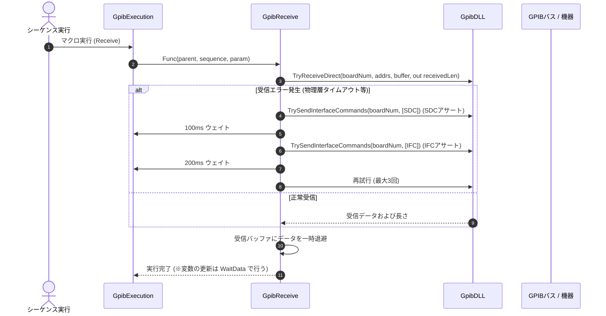

# コマンドリファレンス：Receive

## 概要
`Receive` は、対象機器からのデータ物理受信を制御する物理通信・ライン制御系コマンドです。
単に物理層 of 読み取りを行うだけでなく、物理層エラーやバス固着に対する自動リカバリ手順（エラー検知 ⇒ SDC/IFC送出 ⇒ 最大3回リトライ）を内部に完全内包しており、ノイズ環境下や機器の応答遅延時であってもマクロを停止させない強固な通信品質を保証します。

> 💡 **受信方式の選択について**
> GPIB通信におけるデータ受信方式は、用途や機器の仕様に合わせて以下のいずれかを選択可能です。
> 1. **`Receive` コマンドによるポーリング処理**:
>    `Send` などで測定命令を送信した後、本コマンド（`Receive`）を用いて同期的にデータを物理受信する標準的なポーリング方式。
> 2. **`GET` コマンドによる割り込み処理**:
>    グループ実行トリガー（`GET`）を送信後、機器の測定完了イベント（SRQなど）をWindowsメッセージループ（`WndProc`）で非同期に検知し、自動的に `Receive`（データ受信）を実行するイベント駆動（割り込み）方式。

> 💡 **補足 / ⚠️ 注意**
> 本コマンドは、マクロのステップ実行だけでなくメイン画面上の専用受信ボタン（`btnREC`）のクリックイベントとも共通の受信コアロジックを共有しています。手動で画面上のボタンをクリックした際は、二重実行防止のためのボタン一時無効化（`Enabled = false`）や、稼働状態を示す背景色の一時変化（`Color.Aqua` から 1秒後に `Color.Gainsboro` へ自動復帰）といったカラー制御ライフサイクルが自動実行されます。
> 
> ⚠️ **シーケンスパラメータへの反映について**
> `Receive` コマンド単体の実行では、受信したデータはシーケンスパラメータに即座に反映されません。**Receive 結果をシーケンスパラメータに反映するには、WaitData を用いる必要があります。** 詳細については、[WaitData のリファレンス](../Work/GpibWaitData.Md) を参照してください。

## 🔄 動作フロー（シーケンス図）
本コマンド実行時における、シーケンス実行エンジン（GpibExecution）、コマンドクラス（GpibReceive）、物理通信層（GpibDLL）、および接続機器間のインタラクションを示すシーケンス図です。



---

## 💡 書式・パラメータ仕様

```csv
,SEQUENCE, [ステップキー], Receive
```

### パラメータ（引数）一覧

本コマンドは実行にあたり引数を必要としません。コマンド名（`Receive`）を指定するだけで、文脈上のターゲット機器からデータを抽出し、画面への自動描画および変数バッファへの受け渡しを行います。

| 引数位置 | 引数名 | 説明 | 指定方法 / 有効な入力値 |
| :--- | :--- | :--- | :--- |
| — | — | なし（パラメータの指定は不要です）。 | — |

---

## 🔄 特殊置換規約・分岐規約の適用

本コマンドは引数を必要としないため、独自スクリプトの特殊記法の適用対象外です。

*   **動的置換（`$`）**: 引数を使用しないため、変数置換は使用しません。
*   **条件ジャンプ（`#`）**: 本コマンドはジャンプ処理を行わないため、引数内での `#` によるステップキー指定は使用しません。
*   **カンマのエスケープ**: 引数を持たないため、カンマのエスケープ規約は適用されません。

---

## 💡 動作例（正しい構文での記述例）

### スクリプト記述例
> ⚠️ **記述ルール注意**
> COMMANDブロック配下のため、子要素行（`PARAM`, `SEQUENCE`）は必ず行頭カンマから開始し、スペースインデントや行末コメント（`;`）は記述しないでください。コメントを入れる場合は、必ず独立したコメント行（行頭 `;`）を前に挟んでください。

```csv
COMMAND, "Measure_Read_Macro"
; コメントは独立した行に記述（行末への記述は完全禁止）
,PARAM, V_DATA, Work, "データ格納用", ""
,SEQUENCE, 10, Open
,SEQUENCE, 20, Init
,SEQUENCE, 30, Send, "FUNC DCV AUTO"
; 対象機器から測定データの物理受信を実行（自動リトライ内包）
,SEQUENCE, 40, Receive
; Receive結果をシーケンスパラメータに反映するためWaitDataを実行
,SEQUENCE, 50, WaitData, #30#
,SEQUENCE, 60, SetData, V_DATA, "%s"
,SEQUENCE, 70, Close
```

### 実行時の挙動・変数変化

*   **実行前の状態**: 機器へ測定要求コマンド（`Send`）が送信され、機器側の出力バッファにデータが準備されて受信待機状態になっている状態です。
*   **実行後の状態**: 非同期で受信処理（`BtnReceiveGpibDataAsync` 等）がキックされ、メインUIをフリーズさせることなく安全に通信が行われます。データ読み取りに成功すると、取得データが通信層からシステム内部へ引き渡され、画面へ自動描画されます。

---

## 🚫 エラーハンドリング・安全設計（仕様制限）

入力データの異常や記述ミスに対し、解析・実行エンジンが実行するセーフティ規約です。

*   **1回目の受信に失敗した場合（自動リカバリ・リトライ構造）**
    システムは即座にエラー終了せず、「SDC（選択型デバイスクリア）送出 ⇒ 100msウェイト ⇒ IFC（インターフェースクリア）送出 ⇒ 200msウェイト」という通信層直結のリカバリシーケンスを自律実行しながら、最大3回まで読み取りを再試行します。
*   **最大リトライ（3回）を超過した場合**
    リカバリ処理を施してもデータが一切取得できなかった場合、システムは「致命的なGPIB受信エラー: 最大リトライ回数を超過したため、受信をアボートします。」という明確なエラーログ（`LogError`）を出力し、メソッド自体は `false` を返して安全に後続処理へ制御を戻します。
*   **デバイスオブジェクト欠損時の自動ガード句**
    現在選択されている有効なタブからデバイス情報が取得できない（`device == null`）場合、不正な通信処理を走らせずに即座に `false` を返して安全に早期リターン（処理スキップ）します。
*   **非同期実行時のクロススレッドアクセスが発生した場合**
    マクロ実行エンジン（バックグラウンドスレッド）から呼び出された場合でも、内部で自動的に `targetForm.InvokeRequired` 判定を行います。メインのUIスレッドへ安全に同期ディスパッチしてタスクを起動するため、クロススレッドクラッシュを完全に防止します。
*   **致命的例外の徹底捕捉（LogCritical）**
    DLL層での通信時やUI表示時に予期せぬ内部システム例外が発生した場合、catch ブロックがすべての例外を捕捉します。スタックトレースをログに完全保存（`LogCritical`）し、エディタUIや測定スレッド全体の強制終了を自動防御します。

---

## 🧪 ユニットテスト仕様

本コマンドクラスに実装されている `RunUnitTest()` メソッドが検証するユニットテストの仕様です。

### テスト実行前提条件
* **実行トリガー**: `RunUnitTest()` メソッドの呼び出し
* **有効化条件**: システム全体の最小ログレベル（`ErrorLogger.MinimumLevel`）が `LogLevel.Test` であること（それ以外の場合は無効化ガードにより即座に早期リターン）
* **検証結果出力**: `ErrorLogger.LogTest` によるログ出力。検証失敗時は `ErrorLogger.LogError`、予期せぬ例外発生時は `ErrorLogger.LogCritical` で記録。

### テストケース一覧

| No | テストカテゴリ | テスト条件（入力値） | 期待される結果（出力値） | 検証の目的 / 観点 |
| :--- | :--- | :--- | :--- | :--- |
| **1** | 正常系 | `IsRetryNeeded` に対し、<br>・`attempt = 1, maxRetries = 3, isSuccess = false`<br>・`attempt = 2, maxRetries = 3, isSuccess = false`<br>・`attempt = 3, maxRetries = 3, isSuccess = false`<br>・`attempt = 1, maxRetries = 3, isSuccess = true` | 戻り値:<br>・`true`<br>・`true`<br>・`false`<br>・`false` | 試行回数、最大リトライ回数、成否状態に基づいてリトライが必要であるかどうかが正しく論理判定されるかを検証。 |
| **2** | 正常系 | `GetButtonUiState` に対し、<br>・`true` （処理中）を入力<br>・`false` （非処理中）を入力 | 戻り値:<br>・`true` 入力時は `Enabled` が `false`、`BackColor` が `Color.Aqua`<br>・`false` 入力時は `Enabled` が `true`、`BackColor` が `Color.Gainsboro` | 送受信処理状態に応じた受信ボタン（RECボタン）のUI制御状態（有効化フラグ、背景色）が正しく取得できるかを検証。 |
