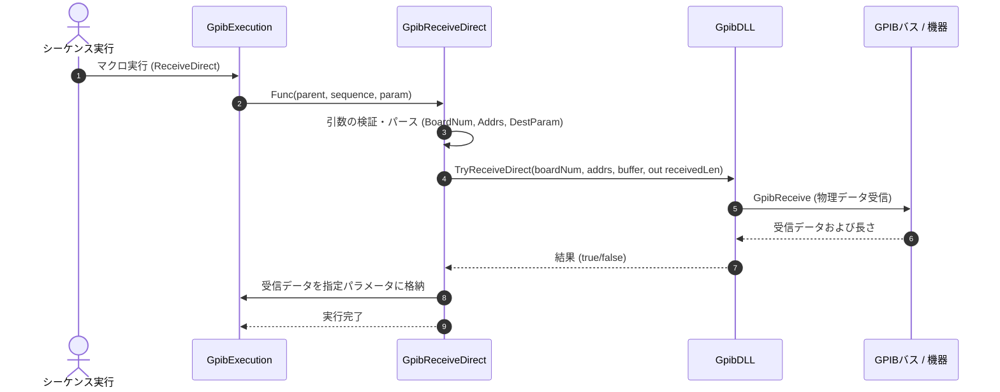

# コマンドリファレンス：ReceiveDirect

## 概要
`ReceiveDirect` は、機器登録（イクウィップメントID）を事前に行わず、ボード番号と受信元アドレスリストを直接指定して、ターゲット機器からデータを直接物理受信し、マクロ変数に格納するためのコマンドです。

## 🔄 動作フロー（シーケンス図）
本コマンド実行時における、シーケンス実行エンジン（GpibExecution）、コマンドクラス（GpibReceiveDirect）、物理通信層（GpibDLL）、および接続機器間のインタラクションを示すシーケンス図です。



---

## 💡 書式・パラメータ仕様

```csv
,SEQUENCE, [ステップキー], ReceiveDirect, [ボード番号], [受信元アドレスリスト], [格納先パラメータ名]
```

### パラメータ（引数）一覧

| 引数位置 | 引数名 | 説明 | 指定方法 / 有効な入力値 |
| :--- | :--- | :--- | :--- |
| **引数1** | ボード番号 | 通信に使用するGPIBボードの番号。 | 整数（例: `"0"`）またはパラメータ動的置換 |
| **引数2** | 受信元アドレスリスト | 受信元の機器プライマリアドレス。カンマ区切りで複数指定可能。 | カンマ区切りの文字列（例: `"1"`） |
| **引数3** | 格納先パラメータ名 | 受信データを格納するパラメータのキー。 | 変数プール（PARAM）に定義されているキー名（例: `RESULT_VAL`） |

---

## 🔄 特殊置換規約・分岐規約の適用
*   **動的置換（`$`）**: すべての引数において `$PARAMキー$` を用いた変数置換が可能です。

---

## 🚫 エラーハンドリング・安全設計
*   引数不足やパース失敗時には、エラーログを出力して処理を安全に早期リターン（処理スキップ）します。
*   指定されたパラメータキーが変数プール内に存在しない場合は、エラーログを出力して無視します。
