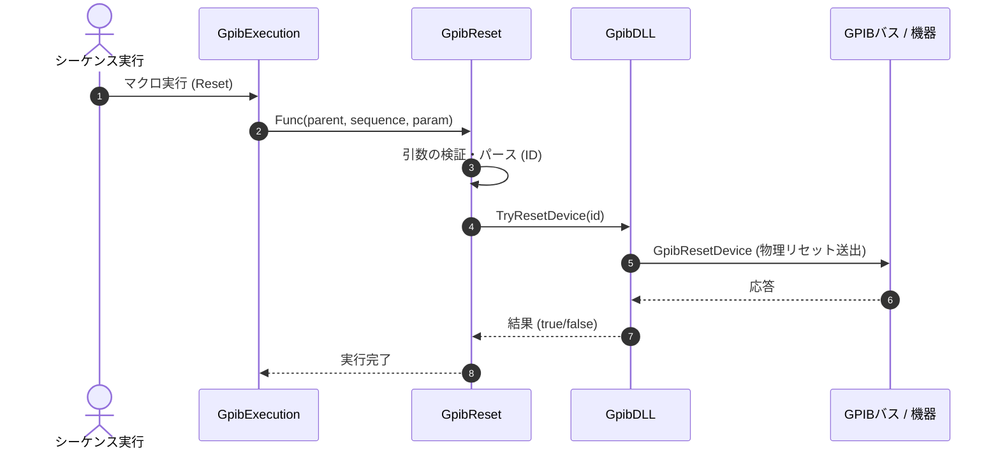

# コマンドリファレンス：Reset

## 概要
`Reset` は、指定されたボードIDまたは装置ID（物理ポートや登録機器）を物理的に再初期化（リセット）するためのコマンドです。特にPCのスリープやスタンバイからの復帰後に発生する通信エラー状態から自律的に復旧するために有効です。

## 🔄 動作フロー（シーケンス図）
本コマンド実行時における、シーケンス実行エンジン（GpibExecution）、コマンドクラス（GpibReset）、物理通信層（GpibDLL）、および接続機器間のインタラクションを示すシーケンス図です。



---

## 💡 書式・パラメータ仕様

```csv
,SEQUENCE, [ステップキー], Reset, [対象のボードID/機器ID]
```

### パラメータ（引数）一覧

| 引数位置 | 引数名 | 説明 | 指定方法 / 有効な入力値 |
| :--- | :--- | :--- | :--- |
| **引数1** | 対象のボードID/機器ID | 物理リセットを実行したいGPIBボードまたは登録機器の識別子。 | 整数（例: `"0"`）またはパラメータ動的置換 |

---

## 🔄 特殊置換規約・分岐規約の適用
*   **動的置換（`$`）**: 引数において `$PARAMキー$` を用いた変数置換が可能です。

---

## 🚫 エラーハンドリング・安全設計
*   引数不足やIDのパース失敗（非数値など）時には、エラーログを出力して処理を安全に早期リターン（処理スキップ）します。
*   物理層からのリセット要求が失敗した場合は、エラーログに詳細を記録します。
