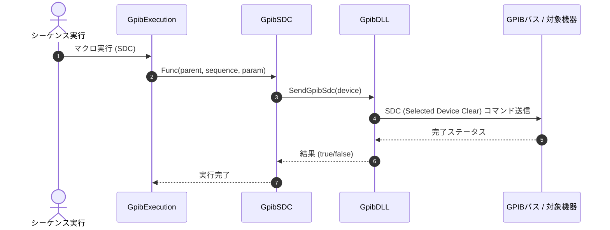

# コマンドリファレンス：SDC

## 概要
`SDC` は、現在選択されているアクティブな特定機器に対して SDC（Selected Device Clear：選択型デバイスクリア）信号を物理送出し、ピンポイントで初期状態へ強制リセットする物理通信・ライン制御系コマンドです。
バス全体をリセットする `DCL` とは異なり、特定デバイスに対するシリアルポーリングや個別制御において、他機器に影響を与えず対象機器のみを安全に初期化したい場合に効果的です。

> 💡 **補足 / ⚠️ 注意**
> 本コマンドは、マクロのステップ実行だけでなくメイン画面上の専用リセットボタン（`btnSDC`）のクリックイベントとも共通の物理層ピンポイントリセットロジックを共有しています。手動で画面上のボタンをクリックした際は、背景色が一時的に `Color.Aqua`（水色）に変化し、コマンド送出完了から1秒間（1000ms）の待機時間を経て通常の `Color.Gainsboro`（薄灰色）に安全に自動復帰する機構を備えています。

## 🔄 動作フロー（シーケンス図）
本コマンド実行時における、シーケンス実行エンジン（GpibExecution）、コマンドクラス（GpibSDC）、物理通信層（GpibDLL）、および接続機器間のインタラクションを示すシーケンス図です。



---

## 💡 書式・パラメータ仕様

```csv
,SEQUENCE, [ステップキー], SDC
```

### パラメータ（引数）一覧

本コマンドは実行にあたり引数を必要としません。コマンド名（`SDC`）を指定するだけで、現在選択されているアクティブなターゲット機器に対してクリア信号を発信します。

| 引数位置 | 引数名 | 説明 | 指定方法 / 有効な入力値 |
| :--- | :--- | :--- | :--- |
| — | — | なし（パラメータの指定は不要です）。 | — |

---

## 🔄 特殊置換規約・分岐規約の適用

本コマンドは引数を必要としないため、独自スクリプトの特殊記法の適用対象外です。

*   **動的置換（`$`）**: 引数を使用しないため、変数置換は使用しません。
*   **条件ジャンプ（`#`）**: 本コマンドはジャンプ処理を行わないため、引数内での `#` によるステップキー指定は使用しません。
*   **カンマのエスケープ**: 引数を持たないため、カンマのエスケープ規約は適用されません。

---

## 💡 動作例（正しい構文での記述例）

### スクリプト記述例
> ⚠️ **記述ルール注意**
> COMMANDブロック配下のため、子要素行（`PARAM`, `SEQUENCE`）は必ず行頭カンマから開始し、スペースインデントや行末コメント（`;`）は記述しないでください。コメントを入れる場合は、必ず独立したコメント行（行頭 `;`）を前に挟んでください。

```csv
COMMAND, "Device_Reset_Macro"
; コメントは独立した行に記述（行末への記述は完全禁止）
,PARAM, V_DATA, Work, "データ格納用", ""
,SEQUENCE, 10, Open
; 対象機器をピンポイントで物理リセット（UIカラーがAquaへ一時変化）
,SEQUENCE, 20, SDC
,SEQUENCE, 30, Init
,SEQUENCE, 40, Send, "*IDN?"
,SEQUENCE, 50, Receive
,SEQUENCE, 60, SetData, V_DATA, "%s"
,SEQUENCE, 70, Close
```

### 実行時の挙動・変数変化

*   **実行前の状態**: 対象機器の応答に異常が見られたり、過去のエラー状態が残って不安定になっている状態です。
*   **実行後の状態**: 選択されているデバイスに対してのみ選択型デバイスクリア（SDC）が物理送出され、該当機器のバッファやエラー状態が安全に初期化されます。（手動で画面上のボタンをクリックして実行した場合は、UI側の `btnSDC` の背景色が一時的に `Color.Aqua`（水色）に変化し、コマンド送出完了から1秒後に自動復帰する視覚効果が発生しますが、マクロからの自動実行時はこのボタン配色の変化は発生しません。）

---

## 🚫 エラーハンドリング・安全設計（仕様制限）

入力データの異常や記述ミスに対し、解析・実行エンジンが実行するセーフティ規約です。

*   **非同期実行時のクロススレッドアクセスが発生した場合**
    マクロの実行エンジン（バックグラウンドスレッド）から呼び出された場合でも、内部で自動的に `InvokeRequired` 判定を行います。メインのUIスレッドへ安全に同期ディスパッチしてタスクを起動するため、クロススレッドクラッシュを完全に防止します。
*   **デバイスオブジェクト欠損・ローカル時の自動ガード句**
    現在有効なタブからデバイス情報が取得できない場合（`device == null`）、または機器が現在リモート状態ではない場合は、無理な物理通信を走らせずに即座に `false` を返して安全に早期リターン（処理スキップ）します。
*   **致命的例外の徹底捕捉（LogCritical）**
    DLL層での通信時やボタンクリック処理中に予期せぬ内部システム例外が発生した場合、catch ブロックがすべての例外を確実に捕捉します。スタックトレースをログに完全保存（`LogCritical`）し、エディタUIや測定スレッド全体の強制終了（連鎖クラッシュ）を自動防御します。

---

## 🧪 ユニットテスト仕様

本コマンドクラスに実装されている `RunUnitTest()` メソッドが検証するユニットテストの仕様です。

### テスト実行前提条件
* **実行トリガー**: `RunUnitTest()` メソッドの呼び出し
* **有効化条件**: システム全体の最小ログレベル（`ErrorLogger.MinimumLevel`）が `LogLevel.Test` であること（それ以外の場合は無効化ガードにより即座に早期リターン）
* **検証結果出力**: `ErrorLogger.LogTest` によるログ出力。検証失敗時は `ErrorLogger.LogError`、予期せぬ例外発生時は `ErrorLogger.LogCritical` で記録。

### テストケース一覧

| No | テストカテゴリ | テスト条件（入力値） | 期待される結果（出力値） | 検証の目的 / 観点 |
| :--- | :--- | :--- | :--- | :--- |
| **1** | 正常系 | `CanSendSdc` に対し、`null` を入力 | 戻り値: `false` | デバイス情報が `null` の場合に、SDC送信不可と正しく判定されるかを検証。 |
| **2** | 正常系 | `CanSendSdc` に対し、非リモート（ローカル状態）の `GpibDevice` オブジェクトを入力 | 戻り値: `false` | 機器がリモート制御状態で設定されていない場合に、SDC送信不可と正しく判定されるかを検証。 |
| **3** | 正常系 | `CanSendSdc` に対し、リモート状態の `GpibDevice` オブジェクトを入力 | 戻り値: `true` | 機器がリモート制御状態で設定されている場合に、SDC送信可能と正しく判定されるかを検証。 |
| **4** | 正常系 | `GetButtonUiState` に対し、<br>・`true` （処理中）を入力<br>・`false` （非処理中）を入力 | 戻り値:<br>・`true` 入力時は `Enabled` が `false`、`BackColor` が `Color.Aqua`<br>・`false` 入力時は `Enabled` が `true`、`BackColor` が `Color.Gainsboro` | 送受信処理状態に応じたSDCボタンのUI制御状態（有効化フラグ、背景色）が正しく取得できるかを検証。 |
