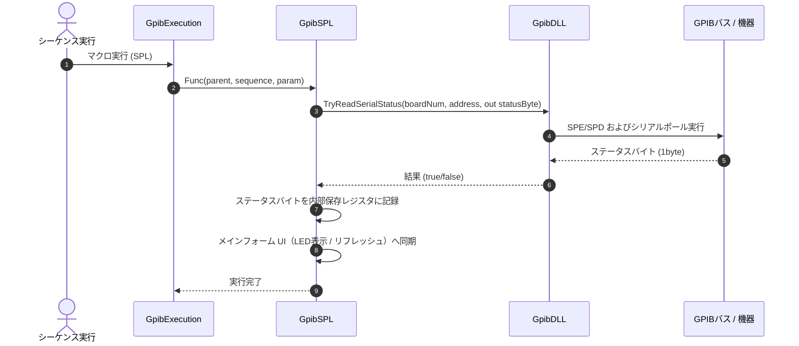

# コマンドリファレンス：SPL

## 概要
`SPL` は、現在アクティブに選択されているターゲットデバイスに対してシリアルポーリング（Serial Poll）を物理実行し、機器から返却された「ステータスバイト（8ビットデータ）」を安全に取得・解析してUI画面へリアルタイムに同期リフレッシュする物理通信・ライン制御系コマンドです。
計測器が測定完了やエラー発生時に発信する「サービス要求（SRQ）」の具体的な要因（何の理由でSRQを出したか）をピンポイントで識別し、マクロ内のフロー制御へ繋げるために使用します。

> 💡 **補足 / ⚠️ 注意**
> 本コマンドは、マクロのステップ実行だけでなくメイン画面上の専用ポーリングボタン（`btnSPL`）のクリックイベントとも共通のシリアルポーリングコアロジックを共有しています。手動で画面上のボタンをクリックした際は、連打防止のためのボタン一時無効化（`Enabled = false`）や、背景色が一時的に `Color.Aqua`（水色）に変化したのち1秒後に通常の `Color.Gainsboro`（薄灰色）へ自動復帰するカラー制御ライフサイクルが自動実行されます。

## 🔄 動作フロー（シーケンス図）
本コマンド実行時における、シーケンス実行エンジン（GpibExecution）、コマンドクラス（GpibSPL）、物理通信層（GpibDLL）、および接続機器間のインタラクションを示すシーケンス図です。



---

## 💡 書式・パラメータ仕様

```csv
,SEQUENCE, [ステップキー], SPL
```

### パラメータ（引数）一覧

本コマンドは実行にあたり引数を必要としません。コマンド名（`SPL`）を指定するだけで、現在選択されているアクティブな機器に対してシリアルポーリングを実行し、状態画面を最新に更新します。

| 引数位置 | 引数名 | 説明 | 指定方法 / 有効な入力値 |
| :--- | :--- | :--- | :--- |
| — | — | なし（パラメータの指定は不要です）。 | — |

---

## 🔄 特殊置換規約・分岐規約の適用

本コマンドは引数を必要としないため、独自スクリプトの特殊記法の適用対象外です。

*   **動的置換（`$`）**: 引数を使用しないため、変数置換は使用しません。
*   **条件ジャンプ（`#`）**: 本コマンドはジャンプ処理を行わないため、引数内での `#` によるステップキー指定は使用しません。
*   **カンマのエスケープ**: 引数を持たないため、カンマのエスケープ規約は適用されません。

---

## 💡 動作例（正しい構文での記述例）

### スクリプト記述例
> ⚠️ **記述ルール注意**
> COMMANDブロック配下のため、子要素行（`PARAM`, `SEQUENCE`）は必ず行頭カンマから開始し、スペースインデントや行末コメント（`;`）は記述しないでください。コメントを入れる場合は、必ず独立したコメント行（行頭 `;`）を前に挟んでください。

```csv
COMMAND, "Wait_Measurement_Complete"
; コメントは独立した行に記述（行末への記述は完全禁止）
,PARAM, P_STATUS, Value, "ステータス比較バッファ", ""
,PARAM, DATA_BUF, Work, "データ回収バッファ", ""
; 1. 機器に測定をキックするコマンドを送信
,SEQUENCE, 10, Send, "INIT"
; 2. 【シリアルポーリング実行】対象機器の最新ステータスバイトを画面と内部メモリへ回収
,SEQUENCE, 20, SPL
; 3. 回収したステータスを一時変数に取得し、完了フラグ（例: "1"）になるまでループ
; （※MODEやEqu等と組み合わせて判定フローを形成します）
,SEQUENCE, 30, MODE, 1
,SEQUENCE, 40, Equ, 1, "MeasurementComplete", #20#
; 4. 完了が確認できたら、安全にデータを回収
,SEQUENCE, 50, Send, "FETCH?"
,SEQUENCE, 60, Receive
,SEQUENCE, 70, SetData, DATA_BUF, "%s"
```

### 実行時の挙動・変数変化

*   **実行前の状態**: 機器へ測定開始コマンド（`INIT`）が送信され、機器の内部で計測処理が実行されている最中の状態です。
*   **実行後の状態**: 対象機器に対して物理的なシリアルポーリング命令が発行され、ステータスバイト（8ビットデータ）が読み出されます。ポーリング成功に伴い `UpdateCurrentTabDisplay()` が自動連動し、構成ファイルの `SERIALSTATUS` であらかじめ定義された各ビット名と照合され、現在の計測器の状態が画面上のUIおよび内部ステータスへ即座にリフレッシュ反映されます。また、非同期実行（`await HandleSerialPollUpdateAsync`）によりメインUIがフリーズしません。

---

## 🚫 エラーハンドリング・安全設計（仕様制限）

入力データの異常や記述ミスに対し、角析・実行エンジンが実行するセーフティ規約です。

*   **物理ポーリング失敗時の保護（TrySerialPoll）**
    ハードウェア層の通信エラー等により `TrySerialPoll` が `false` を返した（失敗した）場合は、無理に画面リフレッシュ（`UpdateCurrentTabDisplay`）を呼び出さず、現在のUI状態を保護したまま安全に処理を抜けます。
*   **デバイスオブジェクト欠損時の自動ガード句**
    現在有効なタブからデバイス情報が取得できない場合（`device == null`）は、無理な物理通信を走らせずに何も処理をせず、即座に安全に早期リターン（処理スキップ）します。
*   **非同期実行時のクロススレッドアクセスが発生した場合**
    マクロ実行エンジン（バックグラウンドスレッド）から呼び出された場合でも、内部で自動的に `InvokeRequired` 判定を行います。UIスレッド（メインフォーム）へ安全にディスパッチして非同期タスクを起動するため、クロススレッドクラッシュを完全に防止します。
*   **致命的例外の徹底捕捉（LogCritical）**
    DLL層での通信時やボタンクリック処理中に予期せぬ内部システム例外が発生した場合、catch ブロックがすべての例外を確実に捕捉します。スタックトレースをログに完全保存（`LogCritical`）し、エディタUIや測定スレッド全体の強制終了（連鎖クラッシュ）を完全に自動防御します。

---

## 🧪 ユニットテスト仕様

本コマンドクラスに実装されている `RunUnitTest()` メソッドが検証するユニットテストの仕様です。

### テスト実行前提条件
* **実行トリガー**: `RunUnitTest()` メソッドの呼び出し
* **有効化条件**: システム全体の最小ログレベル（`ErrorLogger.MinimumLevel`）が `LogLevel.Test` であること（それ以外の場合は無効化ガードにより即座に早期リターン）
* **検証結果出力**: `ErrorLogger.LogTest` によるログ出力。検証失敗時は `ErrorLogger.LogError`、予期せぬ例外発生時は `ErrorLogger.LogCritical` で記録。

### テストケース一覧

| No | テストカテゴリ | テスト条件（入力値） | 期待される結果（出力値） | 検証の目的 / 観点 |
| :--- | :--- | :--- | :--- | :--- |
| **1** | 正常系 | `IsDeviceValid` に対し、`null` を入力 | 戻り値: `false` | デバイス情報が `null` の場合に、デバイス無効と正しく判定されるかを検証。 |
| **2** | 正常系 | `IsDeviceValid` に対し、インスタンス化された `GpibDevice` オブジェクトを入力 | 戻り値: `true` | 有効なデバイス情報が存在する場合に、デバイス有効と正しく判定されるかを検証。 |
| **3** | 正常系 | `GetButtonUiState` に対し、<br>・`true` （処理中）を入力<br>・`false` （非処理中）を入力 | 戻り値:<br>・`true` 入力時は `Enabled` が `false`、`BackColor` が `Color.Aqua`<br>・`false` 入力時は `Enabled` が `true`、`BackColor` が `Color.Gainsboro` | 送受信処理状態に応じたSPLボタンのUI制御状態（有効化フラグ、背景色）が正しく取得できるかを検証。 |
