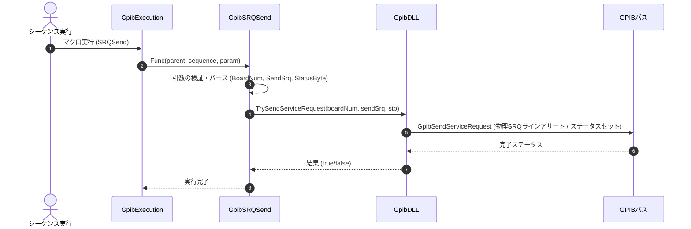

# コマンドリファレンス：SRQSend

## 概要
`SRQSend` は、自ボードがスレーブとして動作している場合に、マスタ（外部コントローラ）に対して物理的にSRQ（サービスリクエスト）を送出または停止し、シリアルポーリング応答用のステータスバイト（STB）を設定するためのコマンドです。

## 🔄 動作フロー（シーケンス図）
本コマンド実行時における、シーケンス実行エンジン（GpibExecution）、コマンドクラス（GpibSRQSend）、物理通信層（GpibDLL）、および接続機器間のインタラクションを示すシーケンス図です。



---

## 💡 書式・パラメータ仕様

```csv
,SEQUENCE, [ステップキー], SRQSend, [ボード番号], [有効フラグ(1/0)], [ステータスバイト値]
```

### パラメータ（引数）一覧

| 引数位置 | 引数名 | 説明 | 指定方法 / 有効な入力値 |
| :--- | :--- | :--- | :--- |
| **引数1** | ボード番号 | 通信に使用するGPIBボードの番号。 | 整数（例: `"0"`）またはパラメータ動的置換 |
| **引数2** | 有効フラグ(1/0) | SRQを送出（アサート）するか、送出停止（ネゲート）するか。 | `"1"` (または `"true"`) で送出、`"0"` (または `"false"`) で停止 |
| **引数3** | ステータスバイト値 | マスタからシリアルポーリングされた際に返却する応答値（STB、通常ビット6(0x40)をアサートして送信）。 | 整数（10進数）または 16進表記（例: `"0x40"` や `"64"`） |

---

## 🔄 特殊置換規約・分岐規約の適用
*   **動的置換（`$`）**: 引数において `$PARAMキー$` を用いた変数置換が可能です。

---

## 🚫 エラーハンドリング・安全設計
*   引数不足やパース失敗時には、エラーログを出力して処理を安全に早期リターン（処理スキップ）します。
*   ステータスバイトの16進指定（`0x` 開始）の解釈に失敗した場合は、エラーログを出力します。
