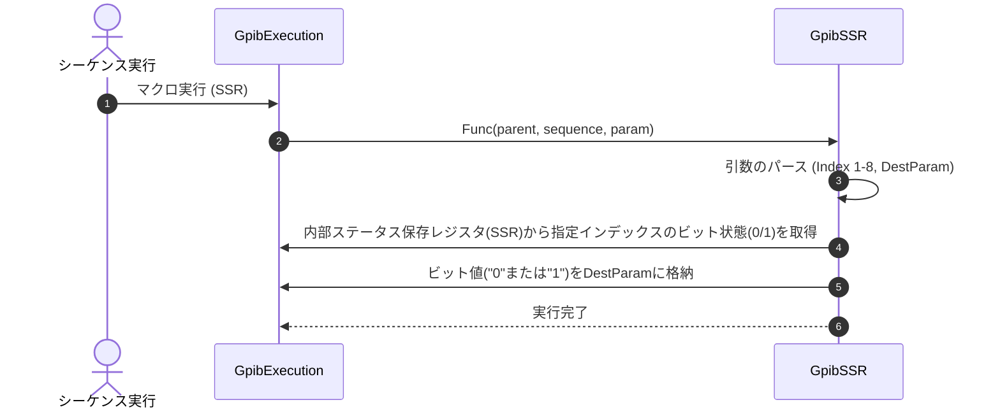

# コマンドリファレンス：SSR

## 概要
`SSR` は、事前に定義されたインデックスに基づいて、対象デバイスのステータス保存レジスタ（SSR：Status Save Register）内の値を読み出し、指定された変数へ文字列として格納するためのフロー・状態管理系シーケンスコマンドです。
直前に実行した `SPL`（シリアルポーリング）などによって更新されたデバイス内部の状態ビットやフラグ情報を個別に抽出し、変数に代入して後続の条件分岐（`Equ` や `Judge` など）へと繋げるために使用します。

> 💡 **補足 / ⚠️ 注意**
> スクリプト上からは直感的に「1番目のレジスタ」「2番目のレジスタ」と指定できる 1オリジン（1ベース）を採用しています。内部の解析処理時に自動で0ベースへと自動補正（`indexValue - 1`）されて安全に処理されます。

## 🔄 動作フロー（シーケンス図）
本コマンド実行時における、シーケンス実行エンジン（GpibExecution）、およびコマンドクラス（GpibSSR）間のインタラクションを示すシーケンス図です。



---

## 💡 書式・パラメータ仕様

```csv
,SEQUENCE, [ステップキー], SSR, [レジスタインデックス], [値の格納先変数]
```

### パラメータ（引数）一覧

| 引数位置 | 引数名 | 説明 | 指定方法 / 有効な入力値 |
| :--- | :--- | :--- | :--- |
| **引数1** | レジスタインデックス | 読み出すステータスレジスタの番号（1以上）。 | 固定値（例: `1`）またはパラメータ動的置換（例: `$P_INDEX$`） |
| **引数2** | 値の格納先変数 | 読み出した状態値を格納する変数名。 | `PARAM` であらかじめ定義した変数キー名（例: `V_STATUS`） |

---

## 🔄 特殊置換規約・分岐規約の適用

本コマンドの引数における、独自スクリプトの特殊記法の適用ルールです。

*   **動的置換（`$`）**: 引数1および引数2の双方において、`$PARAMキー$` のようにパラメータキーの両端を `$` で囲むことで、実行時に変数プール（`PARAM`）の値へと動的にパース展開・置換されます。
*   **条件ジャンプ（`#`）**: 本コマンドはジャンプ処理を行わないため、引数内での `#` によるステップキー指定は使用しません。
*   **カンマのエスケープ**: 本コマンドの引数は数値および変数キーを想定しているため、カンマのエスケープ規約は原則適用されません。

---

## 💡 動作例（正しい構文での記述例）

### スクリプト記述例
> ⚠️ **記述ルール注意**
> COMMANDブロック配下のため、子要素行（`PARAM`, `SEQUENCE`）は必ず行頭カンマから開始し、スペースインデントや行末コメント（`;`）は記述しないでください。コメントを入れる場合は、必ず独立したコメント行（行頭 `;`）を前に挟んでください。

```csv
TITLE, "HP_3458a"
; シリアルポーリング時のビット1を「MeasurementComplete」として定義
,SERIALSTATUS, 1, MeasurementComplete
COMMAND, "Check_Status_Register"
; コメントは独立した行に記述（行末への記述は完全禁止）
,PARAM, P_BUF, Text, "レジスタ取得バッファ", ""
; 1. シリアルポーリングを実行し、デバイス状態を最新に更新
,SEQUENCE, 10, SPL
; 2. 【SSR実行】1番目のレジスタ値（0または1）を抽出し、変数 P_BUF に格納
,SEQUENCE, 20, SSR, 1, P_BUF
; 3. 変数 P_BUF の値が "1"（完了）と不一致なら、再びステップ10へ戻ってループ
,SEQUENCE, 30, Equ, P_BUF, "1", #10#
; 4. 完了確認後の正常系処理
,SEQUENCE, 40, Send, "FETCH?"
```

### 実行時の挙動・変数変化

*   **実行前の状態**: `SPL` コマンドによりデバイス内部の状態ビットが最新に回収され、値を代入するための変数（`P_BUF`）がプール内に確保されている状態です。
*   **実行後の状態**: 構成ファイル（`SERIALSTATUS`）の定義順に従って特定のレジスタ領域から現在の状態値がピンポイントでバインドされ、変数 `P_BUF` に文字列（例: `"0"` または `"1"`）として格納されます。指定されたインデックスが定義範囲外（負の値、または総数超過）である場合は、不正アクセスを防止するためにエラーログを記録して安全に該当ステップをスキップ（早期リターン）します。

---

## 🚫 エラーハンドリング・安全設計（仕様制限）

入力データの異常や記述ミスに対し、解析・実行エンジンが実行するセーフティ規約です。

*   **必須引数の指定が不足している場合**
    引数の指定が2個未満（`sequence.Params.Count < 2`）の場合、「必要な引数が不足しています」というエラーログ（`LogError`）を記録し、データの安全を維持するため処理を行わずに該当ステップを安全にスキップ（早期リターン）します。
*   **引数1（インデックス）の数値変換に失敗した場合**
    引数1に指定された文字列が整数に変換できない（`int.TryParse` に失敗した）場合、不正なメモリアクセスを防ぐためにエラーを出力して安全に処理を中断します。
*   **定義範囲外（レジスタ総数超過）アクセスが発生した場合**
    変換後のインデックスが 0 未満、または `param.Device.StatusNames.Length` 以上の範囲外を指していた場合、「レジスタインデックスがデバイスバッファの範囲外です」とエラーを出力し、メモリ破壊を完全に防止して安全に処理をスキップします。
*   **格納先パラメータが変数プールに存在しない場合**
    引数2で指定された格納先キーが変数プールに存在しない場合、エラーログを出力し、マクロの実行コンテキストを安全に維持したまま次のステップへ安全に遷移します。

---

## 🧪 ユニットテスト仕様

本コマンドクラスに実装されている `RunUnitTest()` メソッドが検証するユニットテストの仕様です。

### テスト実行前提条件
* **実行トリガー**: `RunUnitTest()` メソッドの呼び出し
* **有効化条件**: システム全体の最小ログレベル（`ErrorLogger.MinimumLevel`）が `LogLevel.Test` であること（それ以外の場合は無効化ガードにより即座に早期リターン）
* **検証結果出力**: `ErrorLogger.LogTest` によるログ出力。検証失敗時は `ErrorLogger.LogError`、予期せぬ例外発生時は `ErrorLogger.LogCritical` で記録。

### テストケース一覧

| No | テストカテゴリ | テスト条件（入力値） | 期待される結果（出力値） | 検証の目的 / 観点 |
| :--- | :--- | :--- | :--- | :--- |
| **1** | 正常系 | `ValidateAndConvertIndex` に対し、<br>・`paramCount = 2, rawIndex = "1", statusLength = 8`<br>・`paramCount = 2, rawIndex = "8", statusLength = 8`<br>・`paramCount = 3, rawIndex = "5", statusLength = 8` | 戻り値:<br>・`0`<br>・`7`<br>・`4` | 有効な範囲内のレジスタインデックス（1オリジンベース）から、配列用0ベースインデックスに正しく変換されるかを検証。 |
| **2** | 境界値 / 異常系 | `ValidateAndConvertIndex` に対し、<br>・`paramCount = 1, rawIndex = "1", statusLength = 8` （引数不足）<br>・`paramCount = 2, rawIndex = "abc", statusLength = 8` （パース失敗）<br>・`paramCount = 2, rawIndex = "0", statusLength = 8` （範囲外：下限）<br>・`paramCount = 2, rawIndex = "9", statusLength = 8` （範囲外：上限） | 戻り値:<br>・`-1`<br>・`-1`<br>・`-1`<br>・`-1` | 引数不足、数値変換エラー、またはレジスタ定義範囲外のアクセス要求が、安全に検知・防御されて `-1`（エラー値）を返すかを検証。 |
