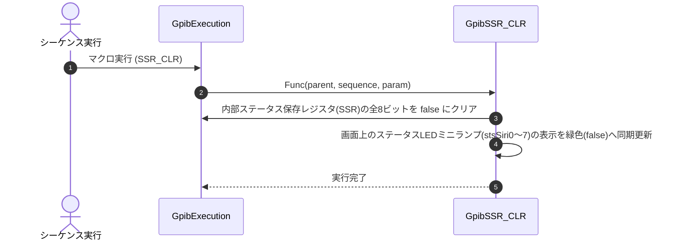

# コマンドリファレンス：SSR_CLR

## 概要
`SSR_CLR` は、現在アクティブな対象デバイスが保持するステータス保存レジスタ（SSR：Status Save Register）の全8ビットを一括してクリア（偽 / `false` に初期化）し、画面上のステータスLEDミニランプ表示をスレッド安全に同期更新するためのフロー・状態管理系シーケンスコマンドです。
新しい測定フェーズや周回ループを開始する直前に、過去の残存フラグ（測定完了フラグやエラーフラグなど）を一括清掃して誤判定を防ぐための初期化層として使用します。

> 💡 **補足 / ⚠️ 注意**
> 本コマンドの実行、あるいは画面の更新メソッド（`UpdateCurrentStatusDisplay`）が呼び出されると、フォーム上の8個のLEDミニランプ（`stsSiri0` 〜 `stsSiri7`）およびユーザー支援機能が正確に同期します。
> 各ミニランプは `false`（クリア状態）で「緑色」、`true`（フラグ検知時）で「赤色」に点灯し、マウスカーソルを合わせると構成ファイル（`SERIALSTATUS`）で定義したビット名称がツールチップとしてポップアップ表示されます。また、デバッグ時は赤点灯しているランプを直接マウスクリックすることで、該当ビットだけをピンポイントで `false` へ安全に手動リセットすることも可能です。

## 🔄 動作フロー（シーケンス図）
本コマンド実行時における、シーケンス実行エンジン（GpibExecution）、およびコマンドクラス（GpibSSR_CLR）間のインタラクションを示すシーケンス図です。



---

## 💡 書式・パラメータ仕様

```csv
,SEQUENCE, [ステップキー], SSR_CLR
```

### パラメータ（引数）一覧

本コマンドは実行にあたり引数を必要としません。コマンド名（`SSR_CLR`）を指定するだけで、現在選択されているアクティブな機器の全レジスタ値および対応する画面上のLEDミニランプを一括リセットします。

| 引数位置 | 引数名 | 説明 | 指定方法 / 有効な入力値 |
| :--- | :--- | :--- | :--- |
| — | — | なし（パラメータの指定は不要です）。 | — |

---

## 🔄 特殊置換規約・分岐規約の適用

本コマンドは引数を必要としないため、独自スクリプトの特殊記法の適用対象外です。

*   **動的置換（`$`）**: 引数を使用しないため、変数置換は使用しません。
*   **条件ジャンプ（`#`）**: 本コマンドはジャンプ処理を行わないため、引数内での `#` によるステップキー指定は使用しません。
*   **カンマのエスケープ**: 引数を持たないため、カンマのエスケープ規約は適用されません。

---

## 💡 動作例（正しい構文での記述例）

### スクリプト記述例
> ⚠️ **記述ルール注意**
> COMMANDブロック配下のため、子要素行（`PARAM`, `SEQUENCE`）は必ず行頭カンマから開始し、スペースインデントや行末コメント（`;`）は記述しないでください。コメントを入れる場合は、必ず独立したコメント行（行頭 `;`）を前に挟んでください。

```csv
TITLE, "HP_3458a"
,SERIALSTATUS, 1, MeasurementComplete
,SERIALSTATUS, 2, DeviceError
COMMAND, "Fresh_Measurement_Loop"
; コメントは独立した行に記述（行末への記述は完全禁止）
,PARAM, P_BUF, Text, "個別判定バッファ", ""
; 1. 【一括クリア】前回の測定ループで残った全8ビットのフラグと画面ランプを完全初期化
,SEQUENCE, 10, SSR_CLR
; 2. 機器に測定をキック
,SEQUENCE, 20, Send, "INIT"
; 3. 最新のステータスバイトを回収
,SEQUENCE, 30, SPL
; 4. 1番目の「MeasurementComplete」の状態を取り出し、完了（1）になるまで待機
,SEQUENCE, 40, SSR, 1, 1
,SEQUENCE, 50, Equ, 1, "1", #30#
```

### 実行時の挙動・変数変化

*   **実行前の状態**: 前回の測定周回や過去のエラーにより、ステータス保存レジスタ（`device[i]`）の一部に `true` フラグが残っており、画面上のLEDミニランプが赤色に点灯している状態です。
*   **実行後の状態**: 対象デバイスオブジェクトの全8ビットのフラグが一瞬にしてすべて `false` へリセットされ、フォーム上の8個のLEDミニランプが一斉に「緑色（安全点灯）」へと同期します。非同期実行時（マクロの別スレッド実行時）であっても、内部で自動的に `this.InvokeRequired` 判定を行いメインUIスレッドへ安全にディスパッチして描画更新するため、画面がフリーズしません。

---

## 🚫 エラーハンドリング・安全設計（仕様制限）

入力データの異常や記述ミスに対し、解析・実行エンジンが実行するセーフティ規約です。

*   **オブジェクト欠損時の自動スキップガード**
    `param.Cmd.GetSeqValueAt` からシーケンス情報が正しくキャストできない場合や、メインフォームの参照（`parent`）がヌルの場合は、無理な通信・描画処理を走らせずに即座に安全に早期リターン（処理スキップ）します。現在有効なタブからデバイス情報が取得できない（`device == null`）場合も、同様にガード句が作動して処理を安全に弾きます。
*   **配列の境界外防御（Math.Min）**
    ランプの数（8個）と、デバイス側が保持する定義数（`StatusNames.Length`）の差異による配列の突き抜けを防ぐため、内部で `Math.Min` による上限の安全クリッピングを行っています。インデックストラブル（`IndexOutOfRangeException`）の発生を完全に防止します。
*   **非同期実行時のクロススレッドアクセスが発生した場合**
    マクロ実行エンジンから呼び出された場合でも、内部で自動的に `this.InvokeRequired` 判定を行い、必ずメインのUIスレッドへ安全にディスパッチ（同期転送）してランプの表示更新を行うため、クロススレッドクラッシュを完全に防止します。
*   **致命的例外の徹底捕捉（LogCritical）**
    リセット処理やコントロールの描画中に予期せぬ内部システム例外が発生した場合、catch ブロックがすべてのエラーを確実に捕捉します。内部ログ（`_log.LogCritical`）へ詳細なスタックトレースを保存し、システム全体の強制終了を未然に防ぎます。

---

## 🧪 ユニットテスト仕様

本コマンドクラスに実装されている `RunUnitTest()` メソッドが検証するユニットテストの仕様です。

### テスト実行前提条件
* **実行トリガー**: `RunUnitTest()` メソッドの呼び出し
* **有効化条件**: システム全体の最小ログレベル（`ErrorLogger.MinimumLevel`）が `LogLevel.Test` であること（それ以外の場合は無効化ガードにより即座に早期リターン）
* **検証結果出力**: `ErrorLogger.LogTest` によるログ出力。検証失敗時は `ErrorLogger.LogError`、予期せぬ例外発生時は `ErrorLogger.LogCritical` で記録。

### テストケース一覧

| No | テストカテゴリ | テスト条件（入力値） | 期待される結果（出力値） | 検証の目的 / 観点 |
| :--- | :--- | :--- | :--- | :--- |
| **1** | 正常系 | `IsDeviceValid` に対し、<br>・`null` を入力<br>・インスタンス化された `GpibDevice` オブジェクトを入力 | 戻り値:<br>・`false`<br>・`true` | デバイス情報の妥当性（`null` ガードを含む）が正しく検証されるかをテスト。 |
| **2** | 正常系 | `ShouldShowRedLamp` に対し、<br>・`true` を入力<br>・`false` を入力 | 戻り値:<br>・`true`<br>・`false` | ステータスレジスタの値に応じて、赤色LEDを表示すべきかどうかの判定が正しく取得できるかを検証。 |
