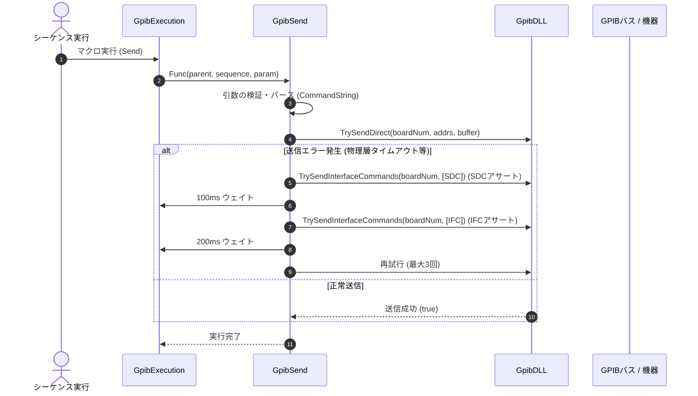

# コマンドリファレンス：Send

## 概要
`Send` は、GPIBバス上のターゲット機器に対して各種制御コマンド（SCPIコマンドや機器固有の設定文字列）を物理送信するための配列バッファ・データ送受信系コマンドです。
単にデータを送信するだけでなく、GPIB特成の「タイムアウト」や「バス固着」に対する「SDCおよびIFCのアサートを伴う最大3回の自動リカバリ・リトライ構造」をコアロジック内に完全内包しており、ノイズ環境下でのライン固着トラブルを自律復旧してマクロの停止を自動防御します。

> 💡 **補足 / ⚠️ 注意**
> 本コマンドは、マクロのステップ実行だけでなくメイン画面上の専用送信ボタン（`btnSND`）のクリックイベントとも共通の物理送信コアロジックを共有しています。手動で画面上のボタンをクリックした際、連打による物理バスへのコマンド重複書き込みを防ぐため一時的にボタンが無効化（`Enabled = false`）され、背景色が一時的に `Color.Aqua`（水色）に変化したのち、1秒後に自動復帰するライフサイクル機構を備えています。

## 🔄 動作フロー（シーケンス図）
本コマンド実行時における、シーケンス実行エンジン（GpibExecution）、コマンドクラス（GpibSend）、物理通信層（GpibDLL）、および接続機器間のインタラクションを示すシーケンス図です。



---

## 💡 書式・パラメータ仕様

```csv
,SEQUENCE, [ステップキー], Send, [送信コマンド文字列]
```

### パラメータ（引数）一覧

| 引数位置 | 引数名 | 説明 | 指定方法 / 有効な入力値 |
| :--- | :--- | :--- | :--- |
| **引数1** | 送信コマンド文字列 | 計測器へ送信する設定コードやクエリ文字列。 | 固定文字列（例: `"RST"`）またはパラメータ動的置換（例: `$P_VOLT$`） |

---

## 🔄 特殊置換規約・分岐規約の適用

本コマンドの引数における、独自スクリプトの特殊記法の適用ルールです。

*   **動的置換（`$`）**: 引数1の文字列内において、`$PARAMキー$` のようにパラメータキーの両端を `$` で囲むことで、実行時に変数プール（`PARAM`）の値へと動的にパース展開されます（例: `SOUR:VOLT $P_VOLT$`）。
*   **条件ジャンプ（`#`）**: 本コマンドはジャンプ処理を行わないため、引数内での `#` によるステップキー指定は使用しません。
*   **カンマのエスケープ**: 引数1の送信文字列自体にカンマを含める場合は、構文エラーを防ぐため必ず `","` と二重引用符で囲んで記述する必要があります。

---

## 💡 動作例（正しい構文での記述例）

### スクリプト記述例
> ⚠️ **記述ルール注意**
> COMMANDブロック配下のため、子要素行（`PARAM`, `SEQUENCE`）は必ず行頭カンマから開始し、スペースインデントや行末コメント（`;`）は記述しないでください。コメントを入れる場合は、必ず独立したコメント行（行頭 `;`）を前に挟んでください。

```csv
COMMAND, "Setup_Voltage_Macro"
; コメントは独立した行に記述（行末への記述は完全禁止）
,PARAM, P_VOLT, Value, "設定電圧値", "5.0"
,PARAM, V_DATA, Work, "データ格納用", ""
,SEQUENCE, 10, Open
,SEQUENCE, 20, REN
,SEQUENCE, 30, Init
; 変数 P_VOLT に格納されている数値を展開し、"SOUR:VOLT 5.0" として物理送信
,SEQUENCE, 40, Send, "SOUR:VOLT $P_VOLT$"
,SEQUENCE, 50, Receive
,SEQUENCE, 60, SetData, V_DATA, "%s"
,SEQUENCE, 70, Close
```

### 実行時の挙動・変数変化

*   **実行前の状態**: 機器との通信回線およびリモート受付状態（`REN`）が確立されており、送信対象のパラメータ（例: `P_VOLT` = `5.0`）が変数プールに準備されている状態です。
*   **実行後の状態**: 文脈上のターゲット機器が自動追跡されて通信タブが同期（`TrySelectDeviceTab`）され、自動的にリモート状態へと移行した上で安全に物理送信が行われます。また、バックグラウンド実行時も送信文字列がメイン画面上の送信メッセージボックス（`txtSend`）へ安全に同期表示されます。ノンブロッキング非同期実行（`await CommandSendAsync`）により、機器の応答遅延時でも画面がフリーズしません。

---

## 🚫 エラーハンドリング・安全設計（仕様制限）

入力データの異常や記述ミスに対し、解析・実行エンジンが実行するセーフティ規約です。

*   **物理層への送信結果がエラー（dllResult != 0）となった場合（自動リカバリ）**
    システムは即座にエラー終了せず、「SDC（選択型デバイスクリア）送出 ⇒ 100msウェイト ⇒ IFC（インターフェースクリア）送出 ⇒ 200msウェイト」という通信層直結のリカバリシーケンスを自律実行しながら、最大3回まで送信を再試行します。
*   **最大リトライ（3回）を超過した場合**
    リカバリ処理を施してもコマンド送信に失敗した場合は、内部エラーログにエラー内容を出力（`LogError`）し、処理をアボートして安全に後続処理へ制御を戻します。
*   **デバイスオブジェクト欠損時の自動ガード句**
    現在有効なタブからデバイス情報が取得できない（`device == null`）場合、不正な通信処理を走らせずに即座に `false` を返して安全に早期リターン（処理スキップ）します。
*   **非同期実行時のクロススレッドアクセスが発生した場合**
    マクロ実行スレッドから呼び出された場合でも、内部で自動的に `targetForm.InvokeRequired` 判定を行います。メインのUIスレッドへ安全にディスパッチ（同期転送）して非同期タスクを起動するため、クロススレッドクラッシュを完全に防止します。
*   **致命的例外の捕捉（LogCritical）**
    DLL層での通信時やUI表示時に予期せぬ内部システム例外が発生した場合、catch ブロックがすべての例外を確実に捕捉します。スタックトレースをログに完全保存（`LogCritical`）し、エディタUIや測定スレッド全体の強制終了を自動防御します。

---

## 🧪 ユニットテスト仕様

本コマンドクラスに実装されている `RunUnitTest()` メソッドが検証するユニットテストの仕様です。

### テスト実行前提条件
* **実行トリガー**: `RunUnitTest()` メソッドの呼び出し
* **有効化条件**: システム全体の最小ログレベル（`ErrorLogger.MinimumLevel`）が `LogLevel.Test` であること（それ以外の場合は無効化ガードにより即座に早期リターン）
* **検証結果出力**: `ErrorLogger.LogTest` によるログ出力。検証失敗時は `ErrorLogger.LogError`、予期せぬ例外発生時は `ErrorLogger.LogCritical` で記録。

### テストケース一覧

| No | テストカテゴリ | テスト条件（入力値） | 期待される結果（出力値） | 検証の目的 / 観点 |
| :--- | :--- | :--- | :--- | :--- |
| **1** | 正常系 | `CanSendCommand` に対し、<br>・`deviceName = null, command = "*IDN?", isPortOpen = true`<br>・`deviceName = "Dev1", command = "", isPortOpen = true`<br>・`deviceName = "Dev1", command = "*IDN?", isPortOpen = false`<br>・`deviceName = "Dev1", command = "*IDN?", isPortOpen = true` | 戻り値:<br>・`false`<br>・`false`<br>・`false`<br>・`true` | デバイス名やコマンド文字列の有無、およびポートのオープン状態に基づいて、送信開始が正しく可否判定されるかを検証。 |
| **2** | 正常系 | `IsRetryNeeded` に対し、<br>・`attempt = 1, maxRetries = 3, isSuccess = false`<br>・`attempt = 2, maxRetries = 3, isSuccess = false`<br>・`attempt = 3, maxRetries = 3, isSuccess = false`<br>・`attempt = 1, maxRetries = 3, isSuccess = true` | 戻り値:<br>・`true`<br>・`true`<br>・`false`<br>・`false` | 試行回数、最大リトライ回数、成否状態に基づいてリトライが必要であるかどうかが正しく論理判定されるかを検証。 |
| **3** | 正常系 | `GetButtonUiState` に対し、<br>・`true` （処理中）を入力<br>・`false` （非処理中）を入力 | 戻り値:<br>・`true` 入力時は `Enabled` が `false`、`BackColor` が `Color.Aqua`<br>・`false` 入力時は `Enabled` が `true`、`BackColor` が `Color.Gainsboro` | 送信処理状態に応じた送信ボタン（SNDボタン）のUI制御状態（有効化フラグ、背景色）が正しく取得できるかを検証。 |
