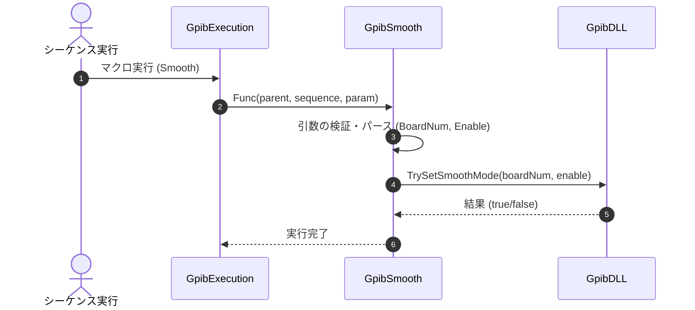

# コマンドリファレンス：Smooth

## 概要
`Smooth` は、指定されたボードに対してスムーズモード（プロトコルハンドシェイク安定化制御）を有効または無効に設定するためのコマンドです。ノイズ環境下での通信安定性を向上させたい場合に有効です。

## 🔄 動作フロー（シーケンス図）
本コマンド実行時における、シーケンス実行エンジン（GpibExecution）、コマンドクラス（GpibSmooth）、および物理通信層（GpibDLL）間のインタラクションを示すシーケンス図です。



---

## 💡 書式・パラメータ仕様

```csv
,SEQUENCE, [ステップキー], Smooth, [ボード番号], [有効フラグ(1/0)]
```

### パラメータ（引数）一覧

| 引数位置 | 引数名 | 説明 | 指定方法 / 有効な入力値 |
| :--- | :--- | :--- | :--- |
| **引数1** | ボード番号 | 設定を行うGPIBボードの番号。 | 整数（例: `"0"`）またはパラメータ動的置換 |
| **引数2** | 有効フラグ(1/0) | スムーズモードを有効にするかどうか。 | `"1"` (または `"true"`) で有効、`"0"` (または `"false"`) で無効 |

---

## 🔄 特殊置換規約・分岐規約の適用
*   **動的置換（`$`）**: 引数において `$PARAMキー$` を用いた変数置換が可能です。

---

## 🚫 エラーハンドリング・安全設計
*   引数不足やボード番号のパース失敗時には、エラーログを出力して処理を安全に早期リターン（処理スキップ）します。
*   **Interface製ドライバー（GPC4304.DLL）環境における動作制限**  
    Interface製ドライバー使用時はスムーズモード機能がサポートされていないため、本コマンドが呼び出された場合は物理通信層への設定は行われず、エラーや例外を発生させることなく安全に処理をスキップ（正常終了扱い）します。ノイズ対策等はドライバー側で自動最適化されるため、設定の必要はありません。
