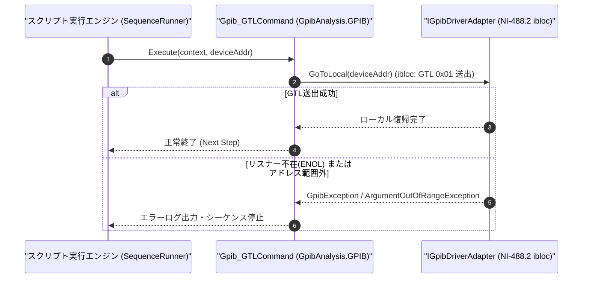

# コマンドリファレンス：Gpib_GTL

## 概要

**Gpib_GTL** は、対象 GPIB デバイス（または指定アドレスの測定器）に対して IEEE 488 アドレス指定コマンド **GTL（Go To Local: `0x01`、NI-488.2 `ibloc` 相当）** を送出し、その測定器をリモート制御状態（REM）からフロントパネル手動操作可能なローカル状態（LOC）へ復帰させるコマンドです。

> 💡 **補足**: REN ライン全体を OFF にする [`Gpib_REN`](./Gpib_REN.Md)（バス上の全機器がローカル化）とは異なり、特定の測定器 1 台のみをローカル操作に戻したい場合にも使用できます。

---

## 💡 書式・パラメータ仕様

### コマンド構文

```csv
,SEQUENCE, [ステップキー], Gpib_GTL, "[DeviceAddress]"
```

### パラメータ（引数）一覧

| 引数位置 | パラメータ名 | 必須/任意 | 型・制約 | 説明 |
| :---: | :--- | :---: | :--- | :--- |
| 第1引数 | `DeviceAddress` | 任意 | 整数（`0`〜`30`） | ローカル復帰させる対象機器のプライマリアドレスを指定します。省略時は現在 `Gpib_Open` されている対象機器へ送出します。 |

---

## 🔄 特殊置換規約・分岐規約の適用

本コマンドの引数における特殊記法および解釈ルールです。
* **動的置換（`$`）**: 引数内で `$PARAMキー$` のように記述すると、実行時に変数プール（PARAM）の値へ動的置換されます。（適用可能な引数: 全引数対応）
* **ジャンプ先指定（`#`）**: 本コマンドはジャンプ制御を行わないため適用されません。（適用可能な引数: 非適用）
* **共通コマンド指定（`@`）**: 本コマンドは外部マクロを呼び出さないため適用されません。（適用可能な引数: 非適用）
* **カンマのエスケープ**: SCPI コマンド等、引数文字列自体にカンマを含める場合は、必ず `","` と二重引用符で囲んで記述します。
* **エイリアス（別名）**: `GTL`, `GpibGTL`

---

## 💡 動作例（正しい構文での記述例）

### スクリプト記述例

※COMMAND ブロック配下の子要素行（PARAM, SEQUENCE）は必ず行頭カンマから開始し、スペースインデントや行末コメント（;）は記述しないでください。

```csv
COMMAND, "SAMPLE_GPIB_GTL", ""
,SEQUENCE, 010, Gpib_Open, "7"
,SEQUENCE, 020, Gpib_Send, "AUTOSCALE"
,SEQUENCE, 030, Wait, "1000"
; オシロスコープをローカル状態(GTL)に戻し、作業者が波形をパネル操作で確認できるようにする
,SEQUENCE, 040, Gpib_GTL
,SEQUENCE, 050, Msg_Box, "オシロスコープの波形を確認し、OKを押してください"
,SEQUENCE, 060, Gpib_Close
,SEQUENCE, 070, Exit
```

### 実行時の挙動・変数変化

* **実行前の状態**: GPIB 通信環境および対象コマンドの PARAM 初期値が設定され、ステップ実行待機中である状態。
* **実行後の状態**: `Gpib_Send, "AUTOSCALE"` によりオシロスコープがリモート制御されます。 `Gpib_GTL` の実行により `GTL (0x01)` が送出され、オシロスコープのフロントパネルノブ・ボタン操作が有効に戻ります。

---

## 🔄 動作フロー（シーケンス図）


```mermaid
sequenceDiagram
    autonumber
    participant Script as "スクリプト実行エンジン (SequenceRunner)"
    participant Cmd as "Gpib_GTLCommand (GpibAnalysis.GPIB)"
    participant Drv as "IGpibDriverAdapter (NI-488.2 ibloc)"

    Script->>Cmd: Execute(context, deviceAddr)
    Cmd->>Drv: GoToLocal(deviceAddr) (ibloc: GTL 0x01 送出)
    alt GTL送出成功
        Drv-->>Cmd: ローカル復帰完了
        Cmd-->>Script: 正常終了 (Next Step)
    else リスナー不在(ENOL) または アドレス範囲外
        Drv-->>Cmd: GpibException / ArgumentOutOfRangeException
        Cmd-->>Script: エラーログ出力・シーケンス停止
    end
```

---

## 🚫 エラーハンドリング・安全設計（仕様制限）

1. **引数個数およびアドレス範囲（`0` 〜 `30`）の事前検証**:
   - `ValidateParamRange(0, 1)` 違反（2 個以上の引数指定）または第 1 引数 `TargetAddress` に `0` 〜 `30` 以外の整数・非数値文字列が指定された場合は、例外クラッシュを起こさず `_log.LogError` を記録し、`SetErrorAndHalt` によりシーケンスを安全停止します。
2. **物理 GTL 送信失敗時の安全停止**:
   - ボード未初期化やバスエラー等により `GpibDLL.TrySendLocal` が失敗（`false`）した場合は、エラーログを記録して `SetErrorAndHalt(-1, ...)` により後続ステップを安全に停止します。

---

## 🧪 ユニットテスト仕様

本コマンドクラス（`Gpib_GTLCommand.cs`）に実装されている `RunUnitTest()` メソッドが検証するユニットテストの仕様です。

### テスト実行前提条件

* **実行トリガー**: `RunUnitTest()` メソッドの呼び出し
* **有効化条件**: システム全体の最小ログレベル（`ErrorLogger.MinimumLevel`）が `LogLevel.Test` であること（それ以外の場合は無効化ガードにより早期リターン）
* **検証結果出力**: `_log.LogTest` によるログ出力。検証失敗時は `_log.LogError`、予期せぬ例外発生時は `_log.LogCritical` で記録し、`finally` ブロックで `GpibDLL.DebugDLL` および `GpibDLL.DebugReceiveData` を元の状態へ復元します。

### テストケース一覧

| No | テストカテゴリ | テスト条件（入力値） | 期待される結果（出力値） | 検証の目的 / 観点 |
| :---: | :--- | :--- | :--- | :--- |
| **1** | 正常系 | `GetGtlButtonStatus()`、`ResolveButtonTargetStatus(Flicker, true/false)`、および `GetNextRemoteStatus(Off)` を実行 | `Off`、トグル `Off` / `On`、および `RemoteStatusEnum.Local` を返す | GTL ボタン状態解決およびローカルステータス遷移計算の検証 |
| **2** | 正常系 | `RemoteStatus = Remote` の `"DEV1"` に対しアドレス `("1")` を指定して `Func` を実行 | `!HasError` となり `dev.RemoteStatus` が `RemoteStatusEnum.Local` へ更新される | シミュレーション環境下でのリモート解除（GTL）動作の検証 |
| **3** | 異常系 | 負のアドレス `("-1")` を指定して `Func` を実行 | `HasError == true` かつ `IsCommandGo == false` となり安全停止する | 範囲外 `Address`（`min: 0`）指定時のバリデーション防護検証 |
