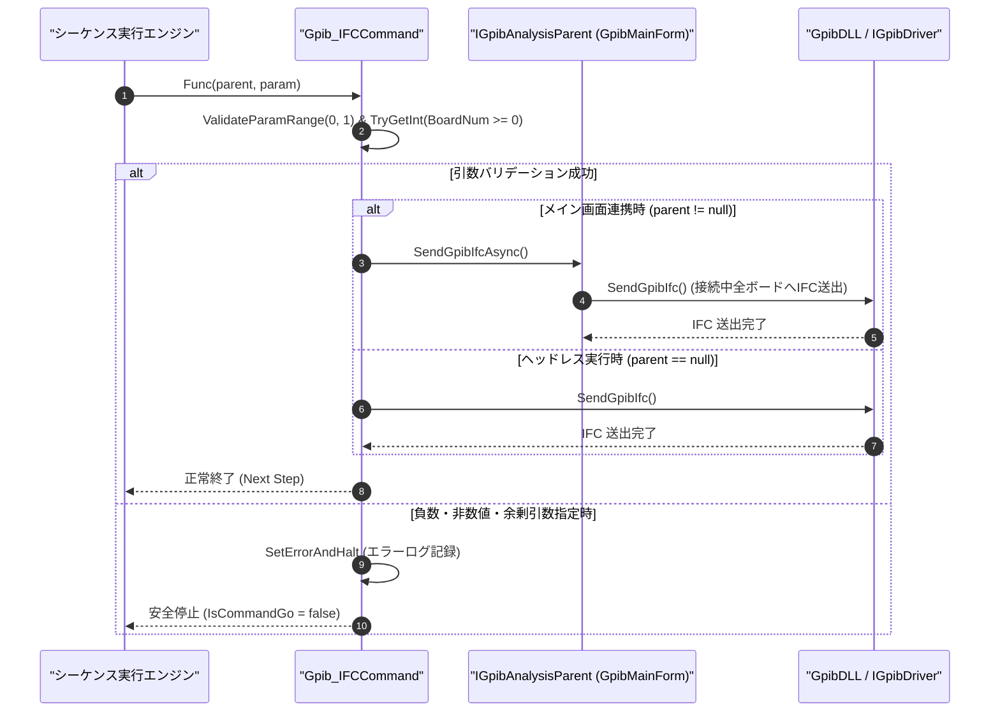

# コマンドリファレンス：Gpib_IFC

## 概要

**Gpib_IFC** は、オープン中の全 GPIB ボードの **IFC（Interface Clear）単一制御ライン** を一定時間（規定 100μs 以上）アサートしてバス上の全デバイスのインターフェース機能（Talker / Listener 状態等）を強制初期化し、コントローラ（PC）へバスの主導権を取り戻すコマンドです。

> 💡 **補足**: 測定器の応答ハングアップ等で GPIB バスがロックした際の緊急バスリセットや、シーケンス冒頭でのバス初期化に使用します。

---

## 💡 書式・パラメータ仕様

### コマンド構文

```csv
,SEQUENCE, [ステップキー], Gpib_IFC, "[BoardNum: 0]"
```

### パラメータ（引数）一覧

| 引数位置 | 引数名 | 説明 | 指定方法 / 有効な入力値 |
| :--- | :--- | :--- | :--- |
| 引数1 | `BoardNum` | IFC（Interface Clear）パルスを送出する GPIB インターフェースボード番号（任意・省略時既定値: `0`）。※引数バリデーション（`0` 以上の整数）のみ行われ、実際の送出はオープン中の全 GPIB ボードに対して一括実行されます。 | `0` 以上の整数（例: `0`）または `$PARAM$` 置換 |

---

## 🔄 特殊置換規約・分岐規約の適用

本コマンドの引数における特殊記法および解釈ルールです。
* **動的置換（`$`）**: 引数内で `$PARAMキー$` のように記述すると、実行時に変数プール（PARAM）の値へ動的置換されます。（適用可能な引数: 全引数対応）
* **ジャンプ先指定（`#`）**: 本コマンドはジャンプ制御を行わないため適用されません。（適用可能な引数: 非適用）
* **共通コマンド指定（`@`）**: 本コマンドは外部マクロを呼び出さないため適用されません。（適用可能な引数: 非適用）
* **カンマのエスケープ**: SCPI コマンド等、引数文字列自体にカンマを含める場合は、必ず `","` と二重引用符で囲んで記述します。
* **エイリアス（別名）**: `IFC`, `GpibIFC`

---

## 💡 動作例（正しい構文での記述例）

### スクリプト記述例

※COMMAND ブロック配下の子要素行（PARAM, SEQUENCE）は必ず行頭カンマ（`,`）から開始してください（行頭スペースのみでは認識されません）。なお、`;` で始まる行やクォート外の `;` 以降はコメントとして自動除去されます。

```csv
COMMAND, "SAMPLE_GPIB_IFC", "DEV_ID"
,PARAM, "DEV_ID", Work, "機器識別情報", ""
,SEQUENCE, 010, Gpib_Open, 0
; 1. IFCを送出してGPIBバス上のTalker/Listener状態を初期化し、RENをONにする
,SEQUENCE, 020, Gpib_IFC
,SEQUENCE, 030, Gpib_REN, "ON"
; 2. 正常化したバスでID照会を実行
,SEQUENCE, 040, Gpib_SendReceive, "*IDN?", "DEV_ID"
,SEQUENCE, 050, Gpib_Close
,SEQUENCE, 060, Exit
```

### 実行時の挙動・変数変化

* **実行前の状態**: GPIB 通信環境および対象コマンドの PARAM 初期値が設定され、ステップ実行待機中である状態。
* **実行後の状態**: `Gpib_IFC` によりオープン中の全 GPIB ボードから IFC 信号が送出され、すべてのスレーブ機器の GPIB インターフェース状態がアイドル（Untalk / Unlisten）にリセットされます（測定器内部の測定設定自体は維持されます）。

---

## 🔄 動作フロー（シーケンス図）


```mermaid
sequenceDiagram
    autonumber
    participant Script as "シーケンス実行エンジン"
    participant Cmd as "Gpib_IFCCommand"
    participant Parent as "IGpibAnalysisParent (GpibMainForm)"
    participant Dll as "GpibDLL / IGpibDriver"

    Script->>Cmd: Func(parent, param)
    Cmd->>Cmd: ValidateParamRange(0, 1) & TryGetInt(BoardNum >= 0)
    alt 引数バリデーション成功
        alt メイン画面連携時 (parent != null)
            Cmd->>Parent: SendGpibIfcAsync()
            Parent->>Dll: SendGpibIfc() (接続中全ボードへIFC送出)
            Dll-->>Parent: IFC 送出完了
        else ヘッドレス実行時 (parent == null)
            Cmd->>Dll: SendGpibIfc()
            Dll-->>Cmd: IFC 送出完了
        end
        Cmd-->>Script: 正常終了 (Next Step)
    else 負数・非数値・余剰引数指定時
        Cmd->>Cmd: SetErrorAndHalt (エラーログ記録)
        Cmd-->>Script: 安全停止 (IsCommandGo = false)
    end
```

---

## 🚫 エラーハンドリング・安全設計（仕様制限）

1. **引数境界・型バリデーション保護**:
   - `ValidateParamRange(0, 1)` 違反（2 個以上の引数指定）または第 1 引数 `BoardNum` に負数（`"-1"` 等）や非数値文字列が指定された場合は、`SetErrorAndHalt` によりエラーログを出力して安全停止します。
2. **未接続・ドライバエラー時の安全継続と [`Gpib_DCL`](./Gpib_DCL.Md) との役割分担**:
   - ポート未接続時は送出を安全にスキップし、物理ドライバがエラーコードを返した場合もログ出力のみで強制停止せず次ステップへ継続します。また、`Gpib_IFC` は通信インターフェース状態のみを初期化するため、機器内部の入出力バッファをクリアしたい場合は [`Gpib_DCL`](./Gpib_DCL.Md) または [`Gpib_SDC`](./Gpib_SDC.Md) を使用してください。

---

## 🧪 ユニットテスト仕様

本コマンドクラス（`Gpib_IFCCommand.cs`）に実装されている `RunUnitTest()` メソッドが検証するユニットテストの仕様です。

### テスト実行前提条件

* **実行トリガー**: `RunUnitTest()` メソッドの呼び出し
* **有効化条件**: システム全体の最小ログレベル（`ErrorLogger.MinimumLevel`）が `LogLevel.Test` であること（それ以外の場合は無効化ガードにより早期リターン）
* **検証結果出力**: `_log.LogTest` によるログ出力。検証失敗時は `_log.LogError`、予期せぬ例外発生時は `_log.LogCritical` で記録し、`finally` ブロックで `GpibDLL.DebugDLL` および `GpibDLL.DebugReceiveData` を元の状態へ復元します。

### テストケース一覧

| No | テストカテゴリ | テスト条件（入力値） | 期待される結果（出力値） | 検証の目的 / 観点 |
| :---: | :--- | :--- | :--- | :--- |
| **1** | 正常系 | `CanSendIfc(true)`（接続中）および `CanSendIfc(false)`（未接続）を実行 | 接続中は `true`、未接続時は `false` を返す | 回線接続状態に応じた IFC 送出可否判定の検証 |
| **2** | 正常系 | `GetButtonUiState(true)`（処理中）および `GetButtonUiState(false)`（待機中）を実行 | 処理中は `(false, Color.Aqua)`、待機中は `(true, Color.Gainsboro)` を返す | IFC 送出中の UI ボタン活性・背景色制御の検証 |
| **3** | 異常系 | 負のボード番号 `("-1")` を指定して `Func` を実行 | `HasError == true` かつ `IsCommandGo == false` となり安全停止する | 範囲外 `BoardNum`（`min: 0`）指定時のエラー停止検証 |
