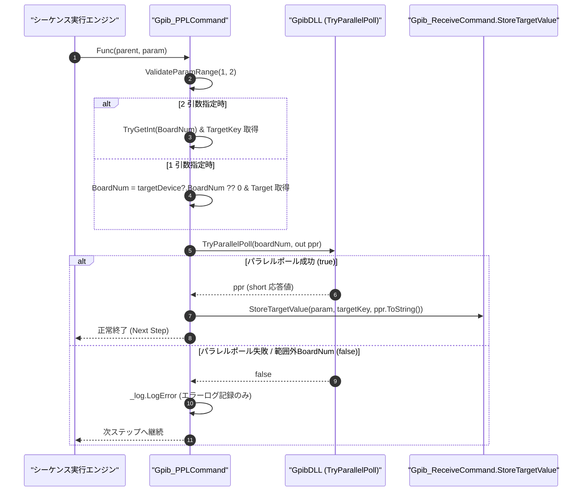

# コマンドリファレンス：Gpib_PPL

## 概要

**Gpib_PPL** は、GPIB バスに対して **パラレルポール（Parallel Poll）** を実行し、最大 8 台のスレーブ機器がデータバス（DIO1〜DIO8）上に同時に出力する 1 ビットステータス応答を 1 バイト整数値（`short`）として一括読み取り、指定ターゲット変数へ格納するコマンドです。

> 💡 **補足**: 複数の測定器の状態を 1 回のバスサイクルで高速に一括チェックする IEEE 488 機能です。1 引数短縮構文ではカレント機器のボード番号（未設定時は `0`）を使用し、2 引数構文では対象ボード番号を明示指定できます。

---

## 💡 書式・パラメータ仕様

### コマンド構文

```csv
; 短縮 1 引数構文（カレント機器のボード番号を使用）
,SEQUENCE, [ステップキー], Gpib_PPL, [Target]

; ボード明示 2 引数構文
,SEQUENCE, [ステップキー], Gpib_PPL, [BoardNum], [TargetKey]
```

### パラメータ（引数）一覧

| 引数位置 | 引数名 | 説明 | 指定方法 / 有効な入力値 |
| :--- | :--- | :--- | :--- |
| 引数1 | `BoardNumOrTarget` | `ParameterSpec` 定義は必須文字列（`RequireString("BoardNumOrTarget")`）。<br> **1 引数指定時** ：パラレルポール応答値（PPR）の格納先キー名（必須）。<br> **2 引数指定時** ：対象 GPIB ボード番号（`Func` 内で `TryGetInt` 整数検証を行い、非数値時はエラーコード `-11` で安全停止、負数指定時は `TryParallelPoll` が `false` を返してエラーログを記録し継続）。 | 格納先 `PARAM` キー名（1 引数時）、または `0` 以上の整数（2 引数時） |
| 引数2 | `TargetKey` | **2 引数指定時** ：8bit パラレルポール応答値を格納するパラメータキー名（必須・1 引数時は省略）。 | 格納先 `PARAM` キー名 |

---

## 🔄 特殊置換規約・分岐規約の適用

本コマンドの引数における特殊記法および解釈ルールです。
* **動的置換（`$`）**: 引数内で `$PARAMキー$` のように記述すると、実行時に変数プール（PARAM）の値へ動的置換されます。（適用可能な引数: 全引数対応）
* **ジャンプ先指定（`#`）**: 本コマンドはジャンプ制御を行わないため適用されません。（適用可能な引数: 非適用）
* **共通コマンド指定（`@`）**: 本コマンドは外部マクロを呼び出さないため適用されません。（適用可能な引数: 非適用）
* **カンマのエスケープ**: SCPI コマンド等、引数文字列自体にカンマを含める場合は、必ず `","` と二重引用符で囲んで記述します。
* **エイリアス（別名）**: `PPL`, `GpibPPL`

---

## 💡 動作例（正しい構文での記述例）

### スクリプト記述例

※COMMAND ブロック配下の子要素行（PARAM, SEQUENCE）は必ず行頭カンマ（`,`）から開始してください（行頭スペースのみでは認識されません）。なお、`;` で始まる行やクォート外の `;` 以降はコメントとして自動除去されます。

```csv
COMMAND, "SAMPLE_GPIB_PPL", "PPL_STATUS"
,PARAM, "PPL_STATUS", Text, "パラレルポール応答", "0"
,SEQUENCE, 010, Gpib_Open, 0
; ボード 0 上のパラレルポール応答バイトを一括取得して PPL_STATUS へ格納
,SEQUENCE, 020, Gpib_PPL, 0, "PPL_STATUS"
,SEQUENCE, 030, Gpib_Close
,SEQUENCE, 040, Exit
```

### 実行時の挙動・変数変化

* **実行前の状態**: GPIB 通信環境および対象コマンドの PARAM 初期値が設定され、ステップ実行待機中である状態。
* **実行後の状態**: `Gpib_PPL` により `GpibDLL.TryParallelPoll` が実行され、DIO1〜DIO8 の状態応答値が 10 進文字列として `"PPL_STATUS"` に格納されます（※ `RecData` 受信バッファ自体は更新されません）。

---

## 🔄 動作フロー（シーケンス図）


```mermaid
sequenceDiagram
    autonumber
    participant Script as "シーケンス実行エンジン"
    participant Cmd as "Gpib_PPLCommand"
    participant Dll as "GpibDLL (TryParallelPoll)"
    participant Var as "Gpib_ReceiveCommand.StoreTargetValue"

    Script->>Cmd: Func(parent, param)
    Cmd->>Cmd: ValidateParamRange(1, 2)
    alt 2 引数指定時
        Cmd->>Cmd: TryGetInt(BoardNum) & TargetKey 取得
    else 1 引数指定時
        Cmd->>Cmd: BoardNum = targetDevice?.BoardNum ?? 0 & Target 取得
    end
    Cmd->>Dll: TryParallelPoll(boardNum, out ppr)
    alt パラレルポール成功 (true)
        Dll-->>Cmd: ppr (short 応答値)
        Cmd->>Var: StoreTargetValue(param, targetKey, ppr.ToString())
        Cmd-->>Script: 正常終了 (Next Step)
    else パラレルポール失敗 / 範囲外BoardNum (false)
        Dll-->>Cmd: false
        Cmd->>Cmd: _log.LogError (エラーログ記録のみ)
        Cmd-->>Script: 次ステップへ継続
    end
```

---

## 🚫 エラーハンドリング・安全設計（仕様制限）

1. **引数個数（`1`〜`2`）およびボード番号の型検証**:
   - `ValidateParamRange(1, 2)` 違反（0 引数または 3 引数以上）や、2 引数指定時の第 1 引数 `BoardNum` に整数変換できない非数値文字列が渡された場合、または格納先キー名が空文字列の場合は、`SetErrorAndHalt` によりエラーログを記録してシーケンスを安全停止します。
2. **ドライバポーリング失敗・範囲外ボード番号時の非停止ログ記録**:
   - 2 引数指定時に負の整数等の未登録ボード番号を指定した場合や、物理バスのパラレルポール実行（`GpibDLL.TryParallelPoll`）が失敗（`false`）した場合は `_log.LogError` を記録しますが、シーケンスは強制停止せず次ステップへ進みます。

---

## 🧪 ユニットテスト仕様

本コマンドクラス（`Gpib_PPLCommand.cs`）に実装されている `RunUnitTest()` メソッドが検証するユニットテストの仕様です。

### テスト実行前提条件

* **実行トリガー**: `RunUnitTest()` メソッドの呼び出し
* **有効化条件**: システム全体の最小ログレベル（`ErrorLogger.MinimumLevel`）が `LogLevel.Test` であること（それ以外の場合は無効化ガードにより早期リターン）
* **検証結果出力**: `_log.LogTest` によるログ出力。検証失敗時は `_log.LogError`、予期せぬ例外発生時は `_log.LogCritical` で記録し、`finally` ブロックで実行前のボード接続状態（`OpenGpibBoards` / `CloseGpibBoards`）および `GpibDLL.DebugDLL`・`DebugReceiveData` を復元します。

### テストケース一覧

| No | テストカテゴリ | テスト条件（入力値） | 期待される結果（出力値） | 検証の目的 / 観点 |
| :---: | :--- | :--- | :--- | :--- |
| **1** | 正常系 | 1 引数指定 `("PPR_KEY1")` および 2 引数指定 `("0", "PPR_KEY2")` で `Func` を実行 | 両ケースとも `!HasError` となり、`Variables["PPR_KEY1"]`・`Variables["PPR_KEY2"]` に応答値 `"0"` が格納される | 短縮 1 引数構文・ボード指定 2 引数構文でのパラレルポール実行と PPR 格納の検証 |
| **2** | 異常系 | 引数不足（0 引数）および非数値ボード番号 `("INVALID", "PPR_KEY")` で `Func` を実行 | 両ケースとも `HasError == true` かつ `IsCommandGo == false` となり安全停止する | 引数個数範囲（`1`〜`2`）および不正 `BoardNum` 指定時の安全停止検証 |
