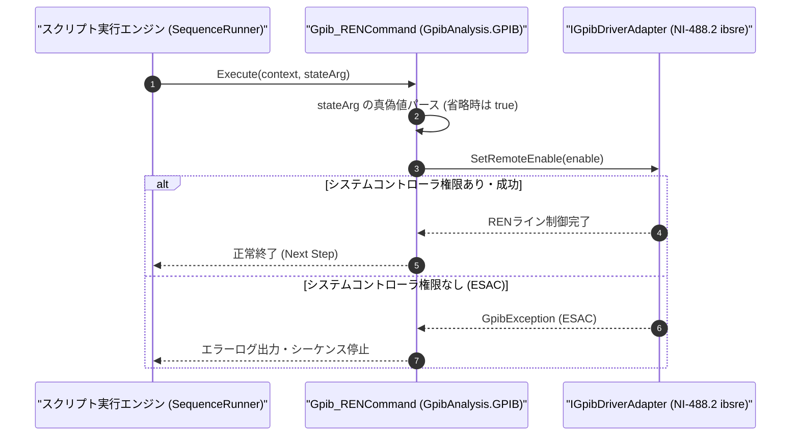

# コマンドリファレンス：Gpib_REN

## 概要

**Gpib_REN** は、GPIB バス上の **REN（Remote Enable）単一制御ライン** をアサート（有効化: リモート制御許可）またはデアサート（無効化: 全機器ローカル制御復帰）するバス制御コマンドです。

> 💡 **補足**: IEEE 488 規格において、測定器を PC からのリモート制御状態に移行させるための前提となるハードウェア制御ライン（NI-488.2 `ibsre` 相当）を制御します。

---

## 💡 書式・パラメータ仕様

### コマンド構文

```csv
,SEQUENCE, [ステップキー], Gpib_REN, "[State: 1 / 0 / ON / OFF / true / false]"
```

### パラメータ（引数）一覧

| 引数位置 | パラメータ名 | 必須/任意 | 型・制約 | 説明 |
| :---: | :--- | :---: | :--- | :--- |
| 第1引数 | `State` | 任意 | `1` / `0` / `ON` / `OFF` / `true` / `false`（既定値: `1`［ON］） | `1` / `ON` / `true` 指定時は REN ラインをアサート（リモート有効）し、`0` / `OFF` / `false` 指定時はデアサート（ローカル復帰）します。省略時は `1`（アサート）となります。 |

---

## 🔄 特殊置換規約・分岐規約の適用

本コマンドの引数における特殊記法および解釈ルールです。
* **動的置換（`$`）**: 引数内で `$PARAMキー$` のように記述すると、実行時に変数プール（PARAM）の値へ動的置換されます。（適用可能な引数: 全引数対応）
* **ジャンプ先指定（`#`）**: 本コマンドはジャンプ制御を行わないため適用されません。（適用可能な引数: 非適用）
* **共通コマンド指定（`@`）**: 本コマンドは外部マクロを呼び出さないため適用されません。（適用可能な引数: 非適用）
* **カンマのエスケープ**: SCPI コマンド等、引数文字列自体にカンマを含める場合は、必ず `","` と二重引用符で囲んで記述します。
* **エイリアス（別名）**: `REN`, `GpibREN`

---

## 💡 動作例（正しい構文での記述例）

### スクリプト記述例

※COMMAND ブロック配下の子要素行（PARAM, SEQUENCE）は必ず行頭カンマから開始し、スペースインデントや行末コメント（;）は記述しないでください。

```csv
COMMAND, "SAMPLE_GPIB_REN", ""
,SEQUENCE, 010, Gpib_Open, "5"
; 1. RENラインをアサートしてリモート制御を有効化
,SEQUENCE, 020, Gpib_REN, "ON"
,SEQUENCE, 030, Gpib_Send, "VOLT 12.0"
; 2. 試験終了時にRENラインをデアサートしてフロントパネル操作を許可
,SEQUENCE, 040, Gpib_REN, "OFF"
,SEQUENCE, 050, Gpib_Close
,SEQUENCE, 060, Exit
```

### 実行時の挙動・変数変化

* **実行前の状態**: GPIB 通信環境および対象コマンドの PARAM 初期値が設定され、ステップ実行待機中である状態。
* **実行後の状態**: `Gpib_REN, "ON"` により GPIB バスの REN ラインが Low（真）にドライブされ、続く `Gpib_Send` で測定器がリモートモード（REM 点灯）になります。 `Gpib_REN, "OFF"` により REN ラインが解放され、バス上の測定器が一斉にローカルモードへ戻ります。

---

## 🔄 動作フロー（シーケンス図）


```mermaid
sequenceDiagram
    autonumber
    participant Script as "スクリプト実行エンジン (SequenceRunner)"
    participant Cmd as "Gpib_RENCommand (GpibAnalysis.GPIB)"
    participant Drv as "IGpibDriverAdapter (NI-488.2 ibsre)"

    Script->>Cmd: Execute(context, stateArg)
    Cmd->>Cmd: stateArg の真偽値パース (省略時は true)
    Cmd->>Drv: SetRemoteEnable(enable)
    alt システムコントローラ権限あり・成功
        Drv-->>Cmd: RENライン制御完了
        Cmd-->>Script: 正常終了 (Next Step)
    else システムコントローラ権限なし (ESAC)
        Drv-->>Cmd: GpibException (ESAC)
        Cmd-->>Script: エラーログ出力・シーケンス停止
    end
```

---

## 🚫 エラーハンドリング・安全設計（仕様制限）

1. **システムコントローラ権限（`ESAC`）の確認**:
   - PC 側の GPIB ボードが System Controller でない場合は REN ラインを駆動できないため、`GpibException` を送出して通知します。
2. **不正な状態文字列の拒否**:
   - `1` / `0` / `ON` / `OFF` / `true` / `false` 以外の文字列が指定された場合は `ArgumentException` を送出します。

---

## 🧪 ユニットテスト仕様

本コマンドクラス（`Gpib_RENCommand.cs`）に実装されている `RunUnitTest()` メソッドが検証するユニットテストの仕様です。

### テスト実行前提条件

* **実行トリガー**: `RunUnitTest()` メソッドの呼び出し
* **有効化条件**: システム全体の最小ログレベル（`ErrorLogger.MinimumLevel`）が `LogLevel.Test` であること（それ以外の場合は無効化ガードにより早期リターン）
* **検証結果出力**: `_log.LogTest` によるログ出力。検証失敗時は `_log.LogError`、予期せぬ例外発生時は `_log.LogCritical` で記録し、`finally` ブロックで `GpibDLL.DebugDLL` および `GpibDLL.DebugReceiveData` を元の状態へ復元します。

### テストケース一覧

| No | テストカテゴリ | テスト条件（入力値） | 期待される結果（出力値） | 検証の目的 / 観点 |
| :---: | :--- | :--- | :--- | :--- |
| **1** | 正常系 | `ResolveRenStatus` に `(On, false)`・`(Off, true)`・`(Flicker, false)`・`(Flicker, true)` を指定して実行 | それぞれ `true`・`false`・`true`・`false` に状態解決される | REN オン／オフ／トグル反転ステータス解決ロジックの検証 |
| **2** | 正常系 | `GetRenButtonColor(true)` および `GetRenButtonColor(false)` を実行 | `true` 時は `Color.Aqua`、`false` 時は `Color.Gainsboro` を返す | REN 状態に応じた UI ボタン背景色判定の検証 |
| **3** | 正常系・異常系 | `CanSetRen(true)` / `(false)` 判定、および負のボード番号 `("-1")` を指定して `Func` を実行 | オープン時のみ `true` を返し、`("-1")` 指定時は `HasError == true`・`IsCommandGo == false` で安全停止する | ポート状態に応じた実行可否判定および範囲外 `BoardNum` バリデーションの検証 |
