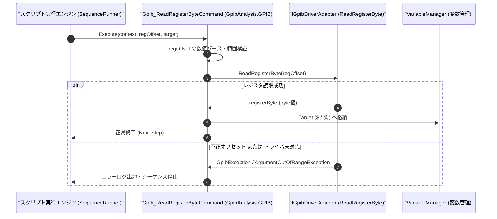

# コマンドリファレンス：Gpib_ReadRegisterByte

## 概要

**Gpib_ReadRegisterByte** は、GPIB コントローラチップ（NEC µPD7210 / NAT9914 / TNT4882 互換レジスタまたはドライバステータス領域）の指定オフセットアドレスから 1 バイト（8bit）のレジスタ値を直接読み取り、指定ターゲット変数へ格納する低レベル診断・制御コマンドです。

> 💡 **補足**: 通常の SCPI 通信では使用しませんが、GPIB バスライン状態（ISR1 / ISR2 / ADSR / BSR 等のハードウェアレジスタ）の詳細診断や特殊ハンドシェイク解析を行う際に使用します。

---

## 💡 書式・パラメータ仕様

### コマンド構文

```csv
,SEQUENCE, [ステップキー], Gpib_ReadRegisterByte, [BoardId], "[Offset]", "[DestKey]"
```

### パラメータ（引数）一覧

| 引数位置 | 引数名 | 説明 | 指定方法 / 有効な入力値 |
| :--- | :--- | :--- | :--- |
| 引数1 | `BoardId` | 読み取り対象の GPIB コントローラボード番号（必須）。 | `0` 以上の整数（例: `0`）または `$PARAM$` 置換 |
| 引数2 | `Offset` | 読み取り対象のコントローラ ASIC 物理レジスタオフセット番号（必須）。 | 整数または 16 進表記（例: `"0"`, `"0x04"`） |
| 引数3 | `DestKey` | 読み取った 1 バイト値を格納する対象パラメータキー名（必須）。 | 格納先 `PARAM` キー名 |

---

## 🔄 特殊置換規約・分岐規約の適用

本コマンドの引数における特殊記法および解釈ルールです。
* **動的置換（`$`）**: 引数内で `$PARAMキー$` のように記述すると、実行時に変数プール（PARAM）の値へ動的置換されます。（適用可能な引数: 全引数対応）
* **ジャンプ先指定（`#`）**: 本コマンドはジャンプ制御を行わないため適用されません。（適用可能な引数: 非適用）
* **共通コマンド指定（`@`）**: 本コマンドは外部マクロを呼び出さないため適用されません。（適用可能な引数: 非適用）
* **カンマのエスケープ**: SCPI コマンド等、引数文字列自体にカンマを含める場合は、必ず `","` と二重引用符で囲んで記述します。
* **エイリアス（別名）**: `ReadRegisterByte`, `GpibReadRegisterByte`

---

## 💡 動作例（正しい構文での記述例）

### スクリプト記述例

※COMMAND ブロック配下の子要素行（PARAM, SEQUENCE）は必ず行頭カンマから開始し、スペースインデントや行末コメント（`;`）は記述しないでください。

```csv
COMMAND, "READ_ASIC_ADSR", "ADSR_VAL"
,PARAM, "ADSR_VAL", Work, "レジスタ読取値", "0"
,SEQUENCE, 010, Gpib_Open, 0
; ボード 0 のオフセット 0x04 レジスタを 1 バイト読み取り ADSR_VAL へ格納
,SEQUENCE, 020, Gpib_ReadRegisterByte, 0, "0x04", "ADSR_VAL"
,SEQUENCE, 030, Gpib_Close, 0
,SEQUENCE, 040, Exit
```

### 実行時の挙動・変数変化

* **実行前の状態**: GPIB ボード `0` がオープン済みで、`"ADSR_VAL"` が `"0"` の状態。
* **実行後の状態**: ステップ `020` の実行によりオフセット `0x04` の物理レジスタ 1 バイト値が読み出され、`"ADSR_VAL"` に格納されます。

---

## 🔄 動作フロー（シーケンス図）


```mermaid
sequenceDiagram
    autonumber
    participant Script as "スクリプト実行エンジン (SequenceRunner)"
    participant Cmd as "Gpib_ReadRegisterByteCommand (GpibAnalysis.GPIB)"
    participant Drv as "IGpibDriverAdapter (ReadRegisterByte)"
    participant Var as "VariableManager (変数管理)"

    Script->>Cmd: Execute(context, regOffset, target)
    Cmd->>Cmd: regOffset の数値パース・範囲検証
    Cmd->>Drv: ReadRegisterByte(regOffset)
    alt レジスタ読取成功
        Drv-->>Cmd: registerByte (byte値)
        Cmd->>Var: Target ($ / @) へ格納
        Cmd-->>Script: 正常終了 (Next Step)
    else 不正オフセット または ドライバ未対応
        Drv-->>Cmd: GpibException / ArgumentOutOfRangeException
        Cmd-->>Script: エラーログ出力・シーケンス停止
    end
```

---

## 🚫 エラーハンドリング・安全設計（仕様制限）

1. **不正なオフセットアドレスの防止**:
   - 負のオフセット値やハードウェアレジスタ空間外のアドレスが指定された場合は、`ArgumentOutOfRangeException` を送出してメモリアクセス違反を防止します。
2. **ターゲット引数必須チェック**:
   - 格納先ターゲット（第 2 引数）が省略された場合は `ArgumentException` を送出します。

---

## 🧪 ユニットテスト仕様

本コマンドクラス（`Gpib_ReadRegisterByteCommand.cs`）に実装されている `RunUnitTest()` メソッドが検証するユニットテストの仕様です。

### テスト実行前提条件

* **実行トリガー**: `RunUnitTest()` メソッドの呼び出し
* **有効化条件**: システム全体の最小ログレベル（`ErrorLogger.MinimumLevel`）が `LogLevel.Test` であること（それ以外の場合は無効化ガードにより早期リターン）
* **検証結果出力**: `_log.LogTest` によるログ出力。検証失敗時は `_log.LogError`、予期せぬ例外発生時は `_log.LogCritical` で記録し、`finally` ブロックで `GpibDLL.DebugDLL` および `GpibDLL.DebugReceiveData` を元の状態へ復元します。

### テストケース一覧

| No | テストカテゴリ | テスト条件（入力値） | 期待される結果（出力値） | 検証の目的 / 観点 |
| :---: | :--- | :--- | :--- | :--- |
| **1** | 正常系 | `ParseNumber("10")` による 10 進数表記オフセット解析を実行 | 整数 `10` が返却される | 10 進数レジスタオフセット文字列の変換検証 |
| **2** | 正常系 | `ParseNumber("0x10")` 解析、および `("0", "0x04", "REG_VAL")` を指定して `Func` を実行 | `16` に変換され、`!HasError` で `Variables["REG_VAL"]` にデバッグ読取値 `"90"` が格納される | 16 進数オフセット解析および物理レジスタ読出・変数格納の検証 |
| **3** | 異常系 | `ParseNumber(null)`・`ParseNumber("INVALID")` 解析、および不正ボード ID `("INVALID", "0", "REG_VAL")` で `Func` を実行 | 数値解析は `0` を返し、`Func` は `HasError == true`・`IsCommandGo == false` で安全停止する | 異常文字列フォールバックおよび不正 `BoardId` 指定時の安全停止検証 |
