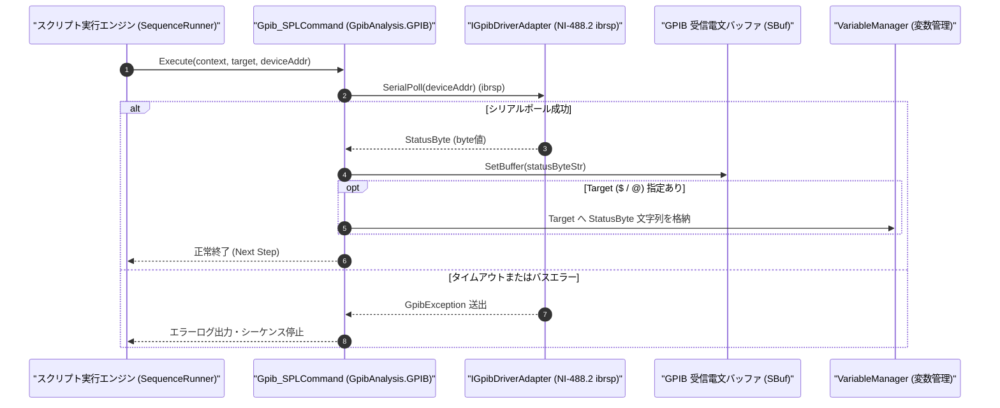

# コマンドリファレンス：Gpib_SPL

## 概要

**Gpib_SPL** は、対象 GPIB デバイスに対して **シリアルポール（Serial Poll: `SPE [0x18]` → ステータスバイト読取 → `SPD [0x19]`）** を実行し、IEEE 488.2 ステータスバイト（STB: Status Byte、ビット 6 が `RQS/MSS` サービス要求ビット、ビット 4 が `MAV` メッセージ有無ビット等）を 1 バイト読み取って指定ターゲット変数へ格納するコマンドです。

> 💡 **補足**: NI-488.2 の `ibrsp` 相当の処理を実行し、測定器が SRQ（サービスリクエスト）を発行した原因の特定や、測定完了（OPC / MAV ビット）の確認に使用します。

---

## 💡 書式・パラメータ仕様

### コマンド構文

```csv
,SEQUENCE, [ステップキー], Gpib_SPL, "[Target]", "[DeviceAddress]"
```

### パラメータ（引数）一覧

| 引数位置 | パラメータ名 | 必須/任意 | 型・制約 | 説明 |
| :---: | :--- | :---: | :--- | :--- |
| 第1引数 | `Target` | 任意 | 変数名（`$` / `@`） | 読み取った 8bit ステータスバイト値（10進または16進文字列）を格納するターゲット変数を指定します。省略時は内部受信バッファ `SBuf` に格納されます。 |
| 第2引数 | `DeviceAddress` | 任意 | 整数（`0`〜`30`） | シリアルポール対象のプライマリアドレスを指定します。省略時は現在オープン中のデバイスを対象とします。 |

---

## 🔄 特殊置換規約・分岐規約の適用

本コマンドの引数における特殊記法および解釈ルールです。
* **動的置換（`$`）**: 引数内で `$PARAMキー$` のように記述すると、実行時に変数プール（PARAM）の値へ動的置換されます。（適用可能な引数: 全引数対応）
* **ジャンプ先指定（`#`）**: 本コマンドはジャンプ制御を行わないため適用されません。（適用可能な引数: 非適用）
* **共通コマンド指定（`@`）**: 本コマンドは外部マクロを呼び出さないため適用されません。（適用可能な引数: 非適用）
* **カンマのエスケープ**: SCPI コマンド等、引数文字列自体にカンマを含める場合は、必ず `","` と二重引用符で囲んで記述します。
* **エイリアス（別名）**: `SPL`, `GpibSPL`

---

## 💡 動作例（正しい構文での記述例）

### スクリプト記述例

※COMMAND ブロック配下の子要素行（PARAM, SEQUENCE）は必ず行頭カンマから開始し、スペースインデントや行末コメント（;）は記述しないでください。

```csv
COMMAND, "SAMPLE_GPIB_SPL", ""
,PARAM, "STB_BYTE", Text, "STB_BYTE", "0"
,SEQUENCE, 010, Gpib_Open, "8"
,SEQUENCE, 020, Gpib_Send, "*CLS;INIT;*OPC"
; SRQまたは処理完了を待機してからシリアルポール(SPL)でステータスバイトを取得
,SEQUENCE, 030, Gpib_Wait, "SRQ", "5000"
,SEQUENCE, 040, Gpib_SPL, "$STB_BYTE$"
,SEQUENCE, 050, Gpib_Close
,SEQUENCE, 060, Exit
```

### 実行時の挙動・変数変化

* **実行前の状態**: GPIB 通信環境および対象コマンドの PARAM 初期値が設定され、ステップ実行待機中である状態。
* **実行後の状態**: `Gpib_SPL` の実行により対象デバイス（アドレス `8`）に対してシリアルポールが行われ、SRQ ラインのアサートがクリアされると同時にステータスバイト値（例: `"64"`［`0x40`: RQS ビット ON］）が `$STB_BYTE` に格納されます。

---

## 🔄 動作フロー（シーケンス図）


```mermaid
sequenceDiagram
    autonumber
    participant Script as "スクリプト実行エンジン (SequenceRunner)"
    participant Cmd as "Gpib_SPLCommand (GpibAnalysis.GPIB)"
    participant Drv as "IGpibDriverAdapter (NI-488.2 ibrsp)"
    participant SBuf as "GPIB 受信電文バッファ (SBuf)"
    participant Var as "VariableManager (変数管理)"

    Script->>Cmd: Execute(context, target, deviceAddr)
    Cmd->>Drv: SerialPoll(deviceAddr) (ibrsp)
    alt シリアルポール成功
        Drv-->>Cmd: StatusByte (byte値)
        Cmd->>SBuf: SetBuffer(statusByteStr)
        opt Target ($ / @) 指定あり
            Cmd->>Var: Target へ StatusByte 文字列を格納
        end
        Cmd-->>Script: 正常終了 (Next Step)
    else タイムアウトまたはバスエラー
        Drv-->>Cmd: GpibException 送出
        Cmd-->>Script: エラーログ出力・シーケンス停止
    end
```

---

## 🚫 エラーハンドリング・安全設計（仕様制限）

1. **アドレス範囲（`0`〜`30`）の検証**:
   - 第 2 引数に範囲外のアドレスが指定された場合は `ArgumentOutOfRangeException` を送出します。
2. **タイムアウト保護**:
   - 対象機器がシリアルポールに応答しない場合はタイムアウト例外を送出して停止します。

---

## 🧪 ユニットテスト仕様

本コマンドクラス（`Gpib_SPLCommand.cs`）に実装されている `RunUnitTest()` メソッドが検証するユニットテストの仕様です。

### テスト実行前提条件

* **実行トリガー**: `RunUnitTest()` メソッドの呼び出し
* **有効化条件**: システム全体の最小ログレベル（`ErrorLogger.MinimumLevel`）が `LogLevel.Test` であること（それ以外の場合は無効化ガードにより早期リターン）
* **検証結果出力**: `_log.LogTest` によるログ出力。検証失敗時は `_log.LogError`、予期せぬ例外発生時は `_log.LogCritical` で記録し、`finally` ブロックで `GpibDLL.DebugDLL` および `GpibDLL.DebugReceiveData` を元の状態へ復元します。

### テストケース一覧

| No | テストカテゴリ | テスト条件（入力値） | 期待される結果（出力値） | 検証の目的 / 観点 |
| :---: | :--- | :--- | :--- | :--- |
| **1** | 異常系 | `IsDeviceValid(null)` 判定、および余剰引数 `("1", "STB_KEY", "EXTRA")` を指定して `Func` を実行 | `IsDeviceValid` が `false` を返し、`Func` は `HasError == true`・`IsCommandGo == false` で安全停止する | `null` デバイスガードおよび引数個数超過（`ValidateParamRange(0, 2)`）時の安全停止検証 |
| **2** | 正常系 | 有効な `"TestDevice"` での `IsDeviceValid(device)` 判定および `("STB_VAL")` 指定での `Func` 実行 | `IsDeviceValid` が `true` を返し、`!HasError` で `Variables["STB_VAL"]` に STB 文字列が格納される | シリアルポール実行およびステータスバイト格納の検証 |
| **3** | 正常系 | `GetButtonUiState(true)` / `(false)` および `CanPoll(device, true)` / `(device, false)` を実行 | UI 状態が `(false, Color.Aqua)` / `(true, Color.Gainsboro)` となり、オープン時のみ `CanPoll == true` を返す | SPL ボタン表示遷移およびポートオープン状態に応じた実行可否の検証 |
